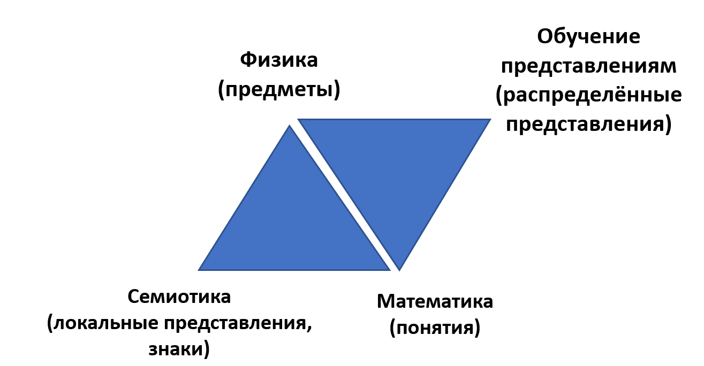

Современная методология использует системный подход для описания
способов работы создателей/агентов в графах создания успешных систем. В
том числе современная методология учитывает, что обычно речь идёт о
каких-то командах агентов и коллективах (командах команд) агентов --- то
есть речь идёт об организациях агентов. Агенты вполне могут быть
владеющими очень небольшим арсеналом элементарных операций --- и перед
ними стоит задача просто отобразить/map какое-то огромное многомерное
пространство входной поступающей информации в пространство действий
весьма малой размерности. Это означает прежде всего, что для выбора
метода (текущая операция с какими-то предметами --- это тоже метод,
возможно довольно мелкий как результат разложения какого-то более
крупного метода) огромное количество информации из окружающего мира
оказывается неважным. А что будет важным? Тут несколько подходов к
выбору метода:

-   Использовать уже имеющееся знание о прикладном методе. Это
    прикладная методология, задействования мета-модели: в данной
    конкретной ситуации с конкретными объектами предметной области надо
    что-то сделать --- вот брать теории/знания/объяснения/алгоритмы
    предметной области, и делать. Скажем, у вас ситуация проектирования
    метода лечения какого-то больного жирафа. Берём предметную область
    ветеринарии, далее делаем назначения, сообразуясь с лучшими на
    сегодня знаниями о том, как лечить зверей, а ещё лучше --- именно
    жирафов. То есть важное тут задаётся типами уровня мета-модели,
    далее делается модель ситуации в этих типах --- и, соответственно, в
    этой ситуации мы создаём модель метода лечения конкретного жирафа в
    его конкретной ситуации, а затем планируем работы по лечению.
    Конечно, эти шаги стратегирования и планирования могут чередоваться:
    мы выбираем не любой метод, а исходим из ресурсных ограничений, то
    есть шаги стратегирования и планирования взаимосвязаны --- но
    рекомендация всё-таки сначала разбираться с вопросом «что будем
    делать», а затем уже «какие ресурсы берём и в какой момент что с
    этими ресурсами делаем», сначала обсуждаем функциональный аспект, и
    только потом --- конструктивный. Если есть какие-то проблемы и
    результаты работы прикладного метода не соответствуют ожидаемым
    (оказались в неизвестной ситуации, «видим что-то неожиданное,
    происходит что-то непонятное, что и с чем делать --- непонятно»), то
    переходим к работам на более высоком уровне абстракции, это изложено
    в следующем пункте текущего списка подходов к выбору метода.
-   Использовать уже имеющееся знание о типах мета-мета-модели,
    например, типах системного подхода. Важные объекты предметной
    области неизвестны, часто неизвестна и сама предметная область.
    Поэтому обращаем внимание на самое важное, что нам известно о
    структуре мира из общекультурного, фундаментального знания, например
    пытаемся определить, какие в этой ситуации системы, какими они
    методами работают, какие роли играют, какой граф создания
    представляют. Затем пытаемся сформулировать какой-то метод работы в
    самых общих чертах (стратегировать, выработать политику ---
    терминология тут разная), после чего опять-таки проводим
    планирование, но скорее всего тут мы будем устраивать эволюцию
    метода: постепенно уточнять как действия, так и предметы этих
    действий, получая новые и новые знания о предметной области, а по
    факту --- формируя эту предметную область, накапливая знания. Те,
    кто придёт работать дальше, уже будут использовать накопленные
    знания, им можно будет начинать не с работы по мета-мета-модели, но
    с работы по мета-модели --- заниматься прикладной методологией. Но в
    полностью новой ситуации надо задействовать фундаментальную
    методологию.
-   В современном интеллект-стеке признаётся, что кроме представления о
    методах работы в форме локальных (символьных) представлений с типами
    и отношениями, а в более современных вариантах --- с типами и
    операциями конструирования типизированных объектов (конструктивный
    подход в математике и логике, переход к алгоритмам от логических
    «доказательств»), существует вариант с распределёнными
    представлениями. И тогда можно применить representations learning,
    «обучение представлениям» --- и какая-нибудь нейросеть (включая,
    заметим, и «мокрая» нейросеть человека, и «сухая» нейросеть
    какого-нибудь робота) может выполнить выявление паттернов как
    предметов метода, так и паттернов эффективных действий с ними.
    Скажем, можно пробовать сформулировать метод вождения автомобиля в
    виде набора правил, но можно просто обучить нейросеть на примере
    огромного числа дорожных ситуаций, и есть множество методов
    подобного обучения. Скажем, так ставит задачу команда Виталия
    Ванчурина, которая использует закономерности физики для выработки
    стратегии (в мире искусственного интеллекта стратегию часто называют
    policy). Подход этой команды сводится к тому, что важную информацию
    не нужно извлекать «грубой силой», но можно использовать понимание
    симметрии системы, чтобы извлечь очень небольшое число важных типов,
    описывающих важные объекты (команда называет эти типы
    «инвариантами»), чтобы получить работоспособные стратегии
    ^[<https://arxiv.org/abs/2301.10077> и проект
    продукта NeuralPilot на основе этих результатов:
    <https://artificialneuralcomputing.com/neurapilot>].
    Вся литература по «обучению с подкреплением» (reinforcement
    learning) по большому счёту --- это литература по стратегированию,
    обучению выбору действий в незнакомой ситуации методом проб и
    ошибок, при этом известно, что будет ошибкой (известная «функция
    награды»). Современная методология наиболее бурно развивается как
    методология в распределённых представлениях. Мы её не будем подробно
    касаться в нашем курсе, но вся проблематика современных систем с
    искусственным интеллектом --- она связана со стратегированием и
    планированием в распределённых представлениях.

Тем самым понимание того, как же мы работаем с методами, как мы выбираем
метод, существенно связано с тем, как мы представляем/represent этот
метод:

-   В локальных представлениях --- на каком уровне абстракции
    (мета-мета-модель, мета-модель, модель)
-   В распределённых представлениях так вопрос даже поставить нельзя,
    это исследовательский фронтир, и в общем случае для агентов задача
    стратегирования и планирования не решена^[«Всё новое
    в методологию приходит сбоку»,
    <https://ailev.livejournal.com/1725419.html>].

Так что для разбирательства с современной методологией надо разобраться
с современной семантикой (учение о представлениях, раньше --- только
локальных, а теперь локальных и распределённых), которая в свою очередь
отсылает к физике и математике, а также семиотике и обучению
представлениям (representations learning) в случае нейросетевых
технологий с их распределёнными представлениями:

При этом для коллективного обсуждения методов и эволюции/развития
методов нам всё равно требуются локальные представления. Без локальных
представлений нельзя передать компактно информацию о методе из,
например, какой-то «сухой» нейросетки, которая научилась что-то делать в
«мокрую» нейросетку человека, чтобы он научился делать что-то подобное.
Скажем, программа AlphaGo научилась играть в Го лучше чемпионов мира. Но
вот передать это знание людям программа не может, указать на важные
объекты в игре --- не может. Проблема совмещения работы с локальными и
распределёнными представлениями (другое её название ---
«нейросимволические вычисления») на сегодня в AI не решена. Более того,
не решена и проблема стратегирования и планирования в распределённых
представлениях для искусственных интеллектуальных агентов. Выбирать
длинные цепочки методов и затем строить разумные планы выполнения
длинных цепочек действий на текущий момент системы искусственного
интеллекта не могут.

Это основная проблема, которая сдерживает сегодня развитие
робототехники: роботов надо программировать, они не могут сами
разобраться с методами своей работы, сопоставить эти методы работы с
предметами окружения, а далее строить длинные планы из цепочек операций
этих методов --- причём подстраивая методы работы под ситуацию в случае
неожиданности (скажем, переходя к методам работы из другой предметной
области: если вы пролили кофе на одежду в момент приготовления кофе, то
вы прервёте приготовление кофе и будете спасать одежду. Увы, современные
роботы не способны к подобным переключениям --- ну, или вам придётся
считать ситуацию «пролил кофе на одежду» частью метода заварки кофе).
Ситуация, конечно, быстро меняется, но даже ведущие исследователи AI
считают, что достижения интеллектуальными агентами уровня работы с
методами и планирования работ хотя бы кошки или крысы --- предмет ещё
нескольких лет работы. В науке это известно как **парадокс**
**Моравека**^[[https://ru.wikipedia.org/wiki/Парадокс\_Моравека](https://ru.wikipedia.org/wiki/Парадокс_Моравека)]:
нейросети сегодня могут поговорить с вами о философии и дать совет по
маркетингу (главным образом на основе того, что они прочли из
написанного людьми, но иногда бывают и новые оригинальные идеи). Для
людей это обычно очень трудно и требует много лет обучения, для
начала --- обучения языку, ведь люди в момент рождения не умеют
разговаривать. С другой стороны, обезьяна видит на дереве банан,
планирует маршрут прохода к этому дереву, а затем ещё и управляет
лапами-хвостом (сотни мышц), чтобы взобраться к банану и взять его.
Современный робот может выполнять только отдельные действия в такой
истории, особые трудности --- в адаптации метода работы к текущей
ситуации и планировании сложных последовательностей действий. Это и есть
парадокс: что легко для животных и людей, то оказывается трудным для
систем AI, а что трудно для животных и людей, то оказывается легко для
AI или даже более простых систем (скажем, калькулятор легко умножает
пятизначные числа, а люди в большинстве своём этого не могут).

Тут ещё надо заметить, что понятия policy и plan в AI относятся к выбору
метода и планированию одновременно, а в менеджменте стратегия и план ---
различаются предметом (стратегирование --- про выбор метода, а
планирование --- про построение графика работ и оптимизацию
использования ресурсов для выполнения работ по методу). Более того,
policy --- это понятие для современного AI, работающего с
распределёнными представлениями и задействующего обучение с
подкреплением, а в старом «логическом» (с экспертными системами)
искусственном интеллекте прошлого века понятие «план» ещё и как в
классическом проектном управлении --- это up front plan (то есть полное
планирование перед производством всех работ, что в реальной жизни уже
признано практически недостижимым, кроме довольно редких ситуаций). План
будет представлять собой строго определенную последовательность
действий, ведущую от начального состояния предметов метода к конечному
(ну, он может быть и сложнее, если у вас есть параллелизм, но это все
равно основная идея). Политика будет определяться набором пар «состояние
предмета метода -\> действие», которые должны позволять из любого
достижимого состояния в конечном итоге достичь заданного сигнатурой
метода
состояния^[<https://www.quora.com/In-artificial-intelligence-which-is-better-policies-or-plans-and-why>].

Интеллектуальные агенты из всего множества IPU (живых и неживых)
выделяются как раз как способные спроектировать по каким-то методам
изменения в своих моделях себя и окружения, а также себя и окружения как
предметов методов, а также запланировать и провести действия по этим
изменениям. Это довольно большой спектр систем, микробы тут вряд ли
будут подходить под «интеллектуальных агентов», кошки --- в малой
степени, а вот люди и тем более «люди с компьютерами»/cyborgs или даже
«компьютеры с людьми в их составе»/hybrots как оргзвенья --- вполне
подходят. И когда мы говорим об агентах, мы чаще всего будем
представлять не просто систему-агента, но интеллектуального агента,
причём чаще всего --- агента-создателя где-то в графе создания какой-то
целевой системы.

Так что после обсуждения семантики и её бурного развития в части
распределённых представлений, мы всё-таки вернёмся в локальные
представления и потребуем знаний в онтологии, ибо само обсуждение
уровней абстракции в выделении важных объектов (работа с типами
мета-мета-моделей, мета-моделей, моделей и предметов моделирования,
которые сами часто в физическом мире, а не мире моделей-описаний) ---
это предмет онтологии. А для понимания онтологии надо разобраться с
теорией понятий, чтобы говорить об объектах и отношениях, или объектах и
операциях их построения --- и противопоставлять их рассказу в терминах
образцов или прототипов, удобных для нестрогой бытовой коммуникации. Для
выбора метода из ряда методов надо ещё знать рациональность, включать
разум. Вот основной алгоритм выбора метода (он сводится к рациональному,
то есть на основе лучших известных нам теорий принятия решений
«прохождения развилки», которое подробно разбирается в курсе «Системной
инженерии» --- смотри там разделы «Принятие решений: прохождение
развилок», «Изобретение: генерация идей для концепции», «Что
обосновывают в инженерии», «Рациональность обоснований» и «Прохождение
архитектурных развилок», но тут мы «проходим развилку» для выбора
метода):

-   Каждый раз, когда вы хотите понять метод, попробуйте точно
    сформулировать его сигнатуру, как-то формализовать эту сигнатуру. Вы
    запросто можете ошибиться в постановке задачи на реализацию какой-то
    функции (для неживых систем) или стратегирование (для
    интеллектуальных создателей), поэтому попробуйте помоделировать.
    Смотрите в окружение, зачем вам вообще надо что-то делать? Если
    делать ничего не надо, то не надо понимать, каким методом!
-   Всегда есть более одного варианта разложения метода, и они абсолютно
    разные в части задействуемых ресурсов и качества результата.
    Возможно, вам надо разложить метод на несколько уровней вниз. Если
    вы считаете, что есть только один вариант, никаких «развилок»,
    никакого принятия решений по выбору из нескольких вариантов
    методов/способов действий, то вы что-то упустили. Подумайте ещё и
    вспомните, погуглите или спросите у AI-ассистента, примените
    какие-то приёмы генерации идей.
-   Затем примите рациональное (то есть на базе лучших теорий принятия
    решений) решение: выберите между альтернативами. Это будет
    неоптимальный выбор, «наименее худшего из всех имеющихся» (ибо
    лучший метод или вы не знаете, или его ещё не изобрели).
-   Обоснуйте выбор, приведите его инженерное обоснование.

Это повседневная работа любого инженера, любого менеджера, любого
разумного человека. Даже чистка зубов требует определения метода:
зубочисткой, жвачкой, ногтем, зубной нитью, щёткой и пастой,
ультразвуковым специальным аппаратом у врача, струёй воды из ирригатора,
жеванием семян кунжута --- и это даже не все методы, например, в Индии
разжёвывают щепочку священного дерева удумбар, и чистят зубы
получившейся щёточкой.

Почему надо это делать на много уровней разложения метода? Потому как на
каждом уровне вы формулируете сигнатуры следующих методов --- и дальше
эту процедуру выбора функции (разузловки, функциональной декомпозиции
или синтеза функций, мы уже обсуждали, что терминология тут может
различаться) или выбора метода (стратегирования) надо будет повторять на
новом уровне --- проверяя, что оптимален весь выбранный стек методов, а
не оптимален один метод в стеке. Например, если вы выберете чистку
зубной пастой и щёткой, то это ещё не конец истории --- если у вас
брекеты, то щётка должна быть V-образной, детям большая щётка не
положена, щётка может быть механической, а выбор пасты будет зависеть
ещё от множества факторов, причём вместо пасты раньше вообще
использовали зубной порошок.

Так что для работы с методами нужно ещё и уметь рационально принимать
решения, опираясь на лучшие известные нам контрфактуальные объяснения. И
это мы даже ещё не весь интеллект-стек методов мышления прошли.

Скажем, ещё надо знать этику, а чтобы не выбрать какой-то метод (недаром
именно в этике говорят, что цели, то есть сигнатуры методов с заданным
состоянием предметов метода, не оправдывают средства, то есть разложение
метода --- цель «вылечить головную боль» не оправдывает средства
«отрубить голову», хотя голова уж точно не будет болеть после того, как
её отрубили. Можно и не свою голову рубить --- была же людоедская
поговорка «нет человека --- нет проблемы»).

Ещё нужна риторика, чтобы как-то убедить других агентов следовать
методу. Так что для понимания и практикования методологии нужно быть
высокообразованным человеком, то есть человеком с сильным интеллектом,
то есть человеком, который бегло владеет всеми методами мышления
интеллект-стека. Собственно, прохождение нашего курса «Методология» в
какой-то мере продвигает в решении этой задачи.

Безмасштабная неантропоцентричная методология готова обсуждать и то,
каким образом создателями могут выступать сообщества, общества и
человечество (в них нет «поручений работ», но разделение труда вроде как
есть), но это пока проработано крайне слабо --- уже понятно, что для
продуктивного создания комфортной/малорисковой среды обитания подходит
рыночная экономика и нужно вводить понятия собственности (включая
собственность на собственное тело, но и на рабочие продукты) и свободы
обмена результатами труда, выходить на праксиологию. Дальше надо
описывать то, каким образом происходит разделение труда --- каким
образом люди узнают, мастерства в каких методах работы не хватает, какие
работы будут в дефиците. Это тесно связано с рыночными ценами: они
передают информацию в подобных распределённых системах о том, где
востребован какой-то вид труда (метод работы), и туда начинается
«межотраслевой перелив капитала», то есть в дефицитный труд идут
инвестиции. Это и есть содержание методологии в варианте праксиологии,
лежащей в основе экономических учений.

Вот, например, праксиология в варианте Murray
Rothbard^[<https://mises.org/library/praxeology-reply-mr-schuller>]
от 1951 года (и нельзя сказать, чтобы человечество сильно продвинулось в
построении этой праксиологии):

Теория изолированного агента (экономика Робинзона Крузо)

Теория добровольного межличностного обмена (каталлактика, или рыночная
экономика)

Бартер

Со средствами для обмена

1.  Свободный рынок
2.  Эффекты насильственного вмешательства в рынок
3.  Эффекты насильственного запрета рынка (социализм)

Теория войны --- враждебная деятельность

Теория игр (например, работы von Neumann and Morgenstern)

Неизвестное

Как при этом должны быть устроены сообщества, общества и человечество в
целом политически и как там должно быть устроено право, основанное на
праксиологии как общей теории деятельности --- это большой вопрос. Наш
курс методологии не будет касаться в текущей версии
практик/деятельности/труда сообществ, обществ и человечества, равно как
будет мало говорить о «методе работы станка» или «методе работы робота»,
хотя в этом случае всё будет проще и понятней, разве что станок и робот
не могут принимать решений о методе своей работы, это за них делают люди
и организации людей, в состав которых входят и станки, и роботы. Но
сейчас с развитием машинного интеллекта возможен и другой вариант
рассмотрения: какой-нибудь отдел может быть представлен как компьютер, в
состав которого входят люди --- и по мере развития постепенно люди
замещаются компьютерами, это и есть тренд «автоматизация всего»,
концепция киборга (cybernetic organism) как образа агента будущего
заменяется концепцией гиброта (hybrot --- hybrid
robot^[<https://en.wikipedia.org/wiki/Hybrot>]).

Само содержание нашего курса методологии связано с тем, что мы
рассматриваем проекты создания и развития систем, которые выполняются
создателями этих систем. Так что последующие разделы можно рассматривать
как продолжение курса системного мышления, и наш курс затронет не только
методологию из интеллект-стека, но попутно даст знания и по другим
фундаментальным дисциплинам --- или хотя бы укажет на необходимость
получения этих знаний (как мы это сделали в текущем подразделе).

В понятия системного подхода второго поколения включают понятие
«жизненный цикл» как проводимые создателями работы по каким-то методам,
а с появлением третьего поколения системного подхода и понятие развития
как происходящее в ходе эволюции системы, и тем самым понятие «жизненный
цикл» как работы создателей по каким-то методам заменилось понятием
«создание и развитие системы» как работы создателей по каким-то методам.
Мы рассматриваем эти понятия в рамках курса методологии, а не курса
системного мышления.

Современная идея в том, что исполнитель каждой прикладной роли
задействует два мастерства методолога на двух онтологических уровнях:

-   Фундаментальное методологическое мастерство (из методов мышления
    интеллект-стека, раскрывается в нашем курсе «Методология», более
    подробно его место в интеллект-стеке раскрывается в курсе
    «Интеллект-стек»). Это умение рассуждать о методах, сравнивать
    методы, описывать методы, убеждаться в реальном выполнении методов в
    ходе работ (например, умение создавать чеклисты). Это уровень
    мета-мета-модели.
-   Прикладное методологическое мастерство как умение разобраться в
    методах работы в его конкретной области. Если это архитектор --- то
    в методах архитектурной работы, если это менеджер-организатор, то в
    методах организационной работы, если это танцор --- то в методах
    танцевания. Всё то же самое, что в фундаментальной методологии, но
    много подробней для конкретной предметной области. Это уровень
    мета-модели.

Так, из фундаментальной методологии вы знаете, что в ходе создания
какой-то системы вам нужно будет создавать функциональные описания --- и
без этого никак нельзя. Всегда будет вопрос «как оно работает», и ответ
должен быть методологический: надо описывать, какими методами мы меняем
состояние каких предметов метода. Но дальше надо владеть каким-то
кругозором многочисленных методов работы и уметь выбрать подходящие
методы работы для получения в ходе работы по этим методам необходимых
состояний объектов --- это владение предметной областью, но не просто
прикладной/предметной онтологией как описанием объектов и отношений в
предметной области, но и прикладной/предметной методологией ---
описанием методов изменения состояний объектов предметной области,
специфичных для этой предметной области.
