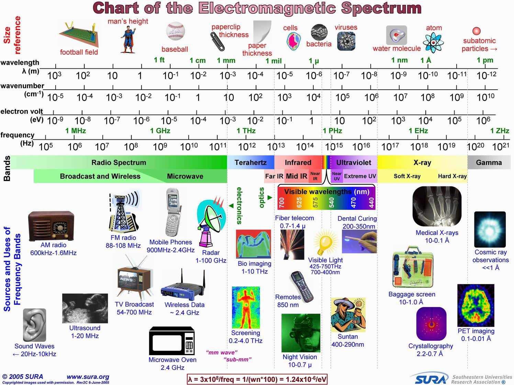
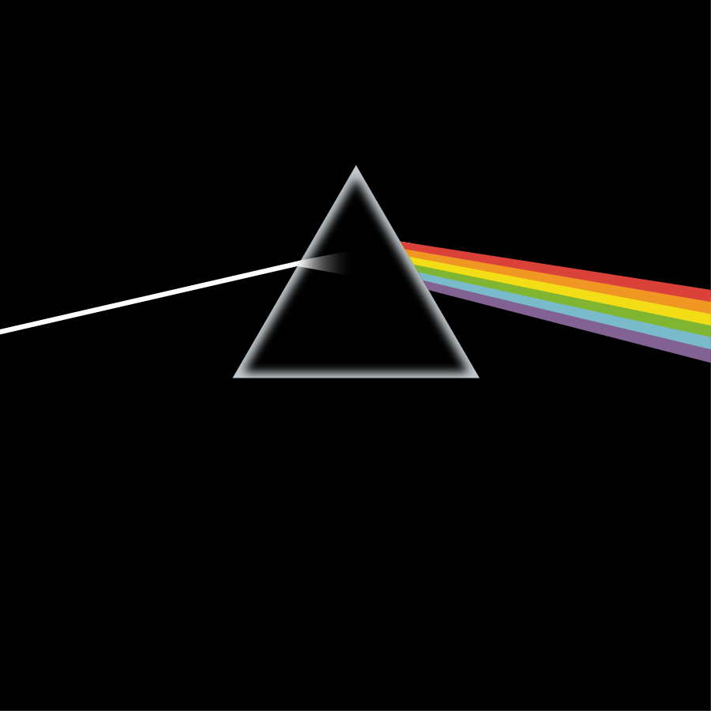
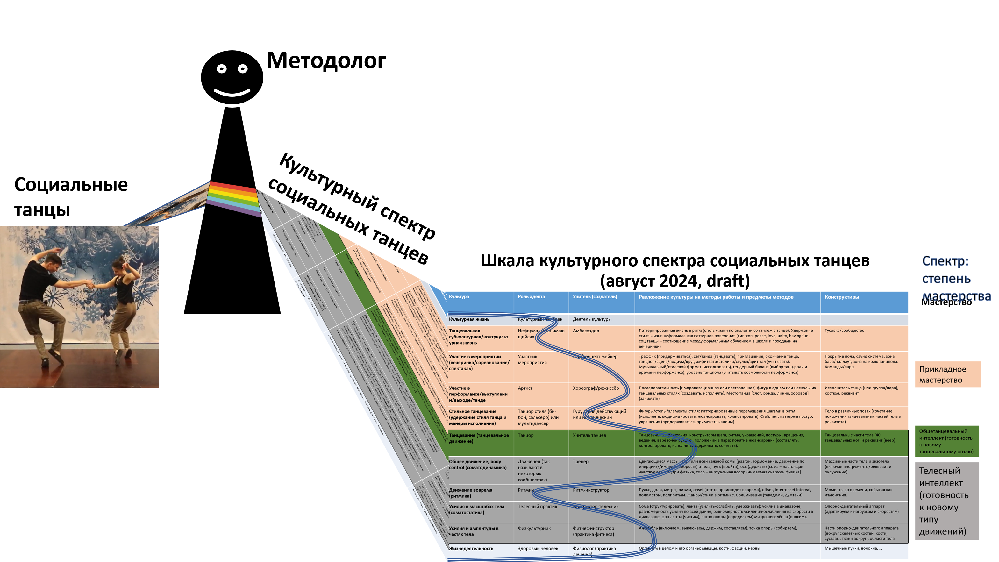
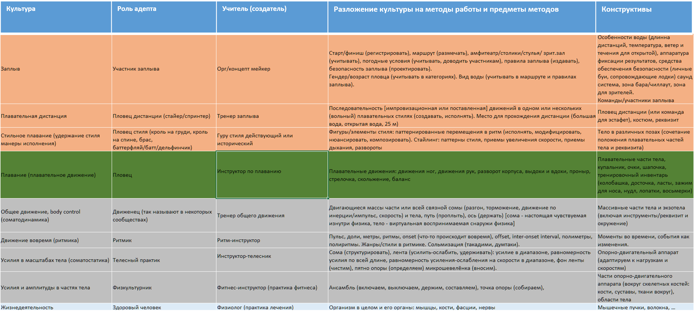
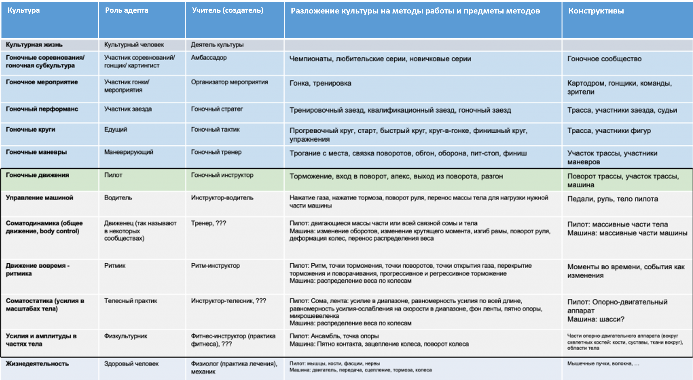
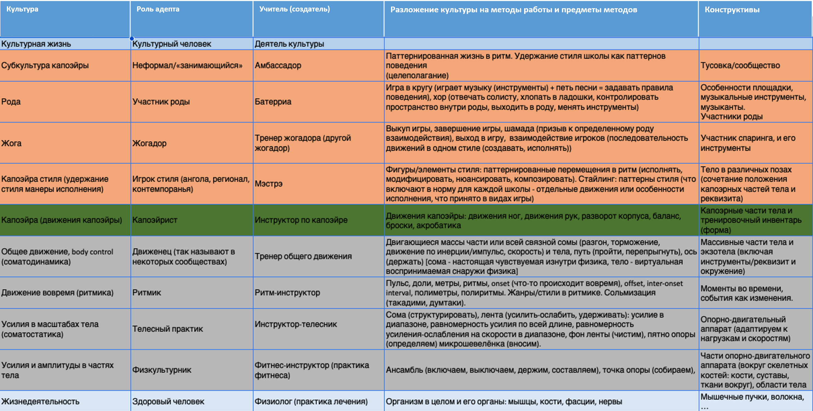

Есть множество трудностей с пониманием самого понятия метода работы ---
очень трудно представить себе, что же это такое. Так, легко представить
себе бегуна, но если попробовать представить бег этого бегуна, то
представится опять-таки бегун, хотя и «развёрнутым видео бегуна в
движении», без бегуна представить бег сложно. В 4D экстенсионализме это
нормально, это подробно разбиралось в курсе «Системное мышление». Но вот
дальше проблемы: надо как-то рассматривать бег как метод работы бегуна,
и тем самым надо выдавать его разложение на разных системных уровнях ---
как работают мышцы, как происходит дыхание, какие позы принимает всё
тело, маршрут движения тела из точки А в точку Б в ходе бега и т.д.. А
уж если попробовать представить разные виды бега как альтернативные
способы --- это будет очень проблемно, но именно этим занимаются тренеры
лёгкой атлетики. Основной способ разбираться с каким-то объектом --- это
разбираться с его составляющими. Но если части и целые собираются в
систему, то с поведением всё не так. Составляющие метода не представляют
собой части и целые, они сосуществуют вместе, сплетаются, выдают
целостное поведение в весьма хитром их соединении. Проще всего
разобраться с этим при использовании аналогий, прежде всего наглядных
аналогий из физики, а не математики.

Роман Варьянко предложил метафору не «разложения функции в ряд», а
«разложение света в спектр», что тоже хорошо подходит под разделение на
части-целые. Это тоже оказалось трудной метафорой, потому что в головах
многих людей со словом «спектр» ассоциируется «радиочастотный спектр»,
который во всех учебниках иллюстрируется не двумерными картинками именно
спектра (распределение мощности электромагнитного излучения по разным
частотным диапазонам), а одномерными картинками шкалы спектра, то есть
картинками частотных диапазонов, или диапазонов длин волн.

Спектр --- это результат разложения чего-то сложного и составного
(намеренно избегаем говорить «целое», ибо разложение не на части этого
целого) на составляющие, отвечающие местам на шкале. Поэтому спектр
какого-то света --- это разложение сложного света по длинам волн, и там
совсем другая картинка, и главное для нас там --- видеть этот начальный
сложный объект и его «разложение», как на вот этой картинке разложения
света призмой^[Обложка альбома The Dark Side of The Moon
группы Pink Floyd,
<https://ru.wikipedia.org/wiki/The_Dark_Side_of_the_Moon>]

С одной стороны белый свет воспринимается как «белый» (это сигнатура), с
другой --- в нём оказывается множество составляющих его цветных
отдельных лучей, но главное --- все эти лучи не части входного пучка, но
всё-таки каким-то образом входной пучок света составлен из эти
составляющих.

Дальше надо бы рассмотреть много терминологических нюансов. Например,
разложение в спектр света на английском --- dispersion/дисперсия, ибо
так это назвал Ньютон. Бывают и разложения в спектр не света или
электромагнитных колебаний по длинам. Можно брать масс-спектры, где
линии спектра соответствуют отношению массы к заряду иона (характеризуют
природу иона, разные ионы имеют разные отношения массы к заряду), а
высота линии --- соответствует концентрации иона. Там тоже смесь ионов
существует как одно целое и происходит разложение для понимания, из
каких ионов составлен раствор. Но в растворе нельзя как-то выявить один
вид ионов как его истинную часть, они же там все перемешаны, нет границы
между ионами разной природы в их растворе! Иногда разложение даётся как
spectral decomposition, таки «разложение», а вот разложение в ряд в
математике --- это расширение (expansion series). При этом разложение
метода не может гарантировать нам какого-то «основания для разложения»,
которое требуется в математике или физике. Шкала тут может быть
сопряжена как-то косвенно с размером частей системы, которые как-то себя
ведут, давая вклад в общее поведение всей системы, или с размером шкалы
во времени, на какой происходит задействование составляющих полного
метода. Сразу всё становится непростым.

В «Системном мышлении» у нас давался для понимания системного мышления
пример танцев, где подчёркивалось выделение каких-то темпоральных
функциональных частей системы вниманием, чтобы предотвратить
представление систем в виде «взрыв-диаграммы» или представление о
поведении системы в её разных частях как пошагово последовательных.
Танцоры танцевали в клубе --- и вниманием можно было выделить и
физиологию работы их тел, и мышечные усилия в телесной работе, и
следование стилю определённого танца, и сам танцевальный перформанс, но
и дальше, на более длинных промежутках времени --- мероприятие в клубе,
посещение школ танцев и клубных вечеринок, бытование в культуре
социальных танцев. А рядом с агентами, которые танцевали, мы описывали
роли создателей --- врачей, тренеров, хореографов, организаторов
вечеринки.

Вернёмся к этому примеру и представим его в виде спектра степени
мастерства танцоров по шкале из разложения методов в некоторый стек
составляющих методов, разве что заменим «метод» словом «культура» ---
это синоним «метода», означающий, что метод получил распространение:

Онтологически различаем разные типы, которые тут отображены:

-   Разные культуры/методы, это актуальные «шаблоны/паттерны поведения»,
    они в жизни --- хотя представлены, конечно, не экземпляры, а типы.
-   Предметы метода --- функциональные объекты, предметы работы ---
    конструктивные объекты (которые тоже могут быть заданы типами).
    Помним, что нам желательно заземлять все предметы методов, ибо в
    конечном итоге нам надо изменить физический мир, но предметы метода
    в общем случае могут быть и описаниями.
-   Культуры характеризуются их теориями/объяснениями/алгоритмами, но
    это знания, которые только описывают поведение точно так же, как
    алгоритм описывает вычисление по нему, он сам --- не вычисление.
    Один алгоритм описывает множество вычислений, которые можно
    выполнить над самыми разными входными данными этого алгоритма.
    Метод --- это «обобщённое вычисление как
    преобразование/transformation входов в выходы, в том числе
    обобщённое на объекты реального мира», производимое какой-то
    программой как «алгоритмом, по которому идёт обобщённый вычислитель
    как создатель/constructor».
-   Составляющие для культуры социальных танцев --- это отдельные
    культуры, каждая работающая со своими предметами методов. Эти
    культуры и будут шкалой. Её можно считать как-то упорядоченной в
    «стек» методов, аналогичный в каком-то смысле платформенному стеку,
    об этом чуть ниже.
-   Агенты, которые практикуют социальные танцы, задействуют для этого
    своё мастерство, имеют степень мастерства (от «не знаю, не
    практикую» до «знаю, практикую, не делаю грубых ошибок, развиваю
    метод»). Эта степень мастерства условно показана не «в целом для
    социальных танцев как культуры», но по каждой из культур разложения
    танцевальной культуры на её составляющие --- и вот это будет
    культурным спектром мастерства социального танцевания, разные
    степени мастерства показаны синей линией. Тем самым оказывается, что
    разложение мастерства в спектр его степеней по составляющим культуры
    по шкале из разложения составляющих культур, упорядоченных как стек.

Хотя мы легко могли бы предложить и другие варианты спектрального
представления: спектр общепринятости (распространённости этой культуры
среди населения), спектр универсальности (тут мы касаемся «стековости»
представления --- ожидаем, что нижние уровни стека более распространены,
чем верхние, то есть телесные практики будут задействованы и в спектре
культуры социальных танцев, и в спектре культуры лёгкой атлетики, и в
спектре культуры восточных единоборств), спектр документированности (где
есть отчуждаемые от носителей культуры описания знаний, а где до сих пор
«традиция устной передачи», на предприятиях это уровень документирования
рабочих процессов. Помним, что один из синонимов для «метода» --- это
«рабочий процесс»).

Шкала разложения методов для спектра мастерства по ним часто
представлена как «стек методов», аналогично платформенному стеку. В
социальных танцах на верхнем уровне мы можем говорить об их общей
культуре, в серединке --- культуре отдельных стилей, внизу --- о
каких-то телесных практиках. Можно говорить о «стеке», если обсуждаем
разложение разных методов. Если делаем замер мастерства --- о том же
«стеке» говорим как о «шкале».

Если это мастерство разбираться с чем-то новым, ранее не виденным, то
его мы называем интеллектом --- для прикладных методов это будет
прикладной интеллект. Грубо говоря, в ПТУ учат действовать в хорошо
известной ситуации, дают мастерство, а в университете --- учат
действовать в новых ситуациях, дают интеллект. Подробнее --- в курсах
«Инженерия личности», «Интеллект-стек».

Вот вам ещё аналогичная табличка разложения методов плавания (авторство
Юлии Чайковской). В случае плавания можно говорить и «культура
плавания», и «методы плавания», и «практики плавания», помним о
синонимии. Не будем уже показывать пловцов, «призму», рисовать спектр
мастерства по разным субкультурам (осторожно применим «суб-», понимая,
что речь идёт о составляющих метода, проявляющихся одновременно, и это
не «части культуры», а «составляющие культуры» как составляющие цвета в
спектре какого-то белого луча света являются составляющими, но не
частями исходного белого цвета луча света). Но проиллюстрируем идею
«стека» как шкалы для разложения мастерства плавания.

Хорошо видно, что по сравнению с танцами низ стека культур не
отличается --- методы телесной работы и движения одни и те же, но вот
начиная с зелёным выделенного «плавания» (плавательного движения, в
танцах это было также выделенное зелёным «танцевание», танцевальное
движения) и выше --- всё другое.

Дальше, если вы пловец --- вы можете оценить по этой табличке свою
культуру плавания. «Оценить культуру плавания» --- это частый способ
говорить об общем мастерстве в самых разных культурах, в которые
разлагается культура плавания, или даже не о мастерстве, а в его высших
проявлениях --- интеллекте, если речь идёт об освоении новых ситуаций,
где вы практикуете плавание. Для этого вы можете оценить свой уровень
владения каким-то из упомянутых в табличке методов из «плавательного
стека», и построить ваш спектр мастерства. Дальше вы можете каким-то
образом стратегировать: строить стратегию ваших тренировок
(стратегия --- это метод, когда вы выбрали его в ситуации, где непонятно
что делать), затем планировать тренировки (планировать трату ресурсов на
тренировки). Вы можете усиливать свои сильные стороны, подтягивать
слабые стороны, решить, что вообще займётесь чем-то другим --- поменяете
метод (скажем, замените плавание картингом, сохранив при этом всё ваше
телесное мастерство).

Вот практики (возьмём ещё один синоним) картинга на базе того же
разложения телесной культуры, которое мы использовали для танцев и
плавания^[<https://systemsworld.club/t/topic/4319>]:

Вот капоэйра в таком же
представлении^[<https://systemsworld.club/t/post-na-pomidorku-kapoejra/12031>]:

Ещё тут можно обратить внимание на пример того, что «стиль» относится к
довольно частным составляющим разложения метода. В принципе, можно
говорить о танцах, плавании, капоэйре как о стилях движения, но чаще
говорят как о чём-то большом и распространённом --- культурах движения,
а вот стили --- это уже «внутри», причём в этих строчках можно будет
найти альтернативные стили (вы плывёте или брассом, или кролем, или
баттерфляем, или на спине, или «по-собачьи» --- и когда вы выбираете
метод в ходе стратегирования, то из всех возможных вариантов выберете
или даже создадите какой-то один стиль и потом будете оттачивать ваше
мастерство именно в этом варианте стиля, возможно, чередуя его с другими
стилями. В восточных единоборствах принято отточить своё мастерство в
одном из стилей, затем в паре-тройке стилей, а затем создать свой
стиль --- это связывают с ростом мастерства следования культуре в
целом).

Эти таблички демонстрируют два вполне совместимых взгляда на разложение
метода/культуры/инженерии/практики работы:

-   объяснение того, что в одной и той же работе какой-то системы (в том
    числе системы-создателя, работе агента) можно увидеть много разных
    шаблонов/методов, как много разных «частных» цветов можно увидеть в
    белом «полном» свете (много частей
    спектра^[[https://ru.wikipedia.org/wiki/Спектр](https://ru.wikipedia.org/wiki/Спектр)]
    можно разглядеть в полном спектре, «разглядеть» тут --- буквально,
    spectrum --- это «видение» от латинского spectare, «смотреть»).
    Говорим о шкале.
-   объяснение того, что мы можем переиспользовать какую-то часть
    разложения метода как «методы платформы», «основание стека методов»,
    а другую --- заменять. Говорим не столько о шкале, сколько о
    «стеке».
