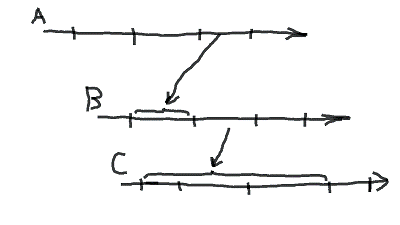
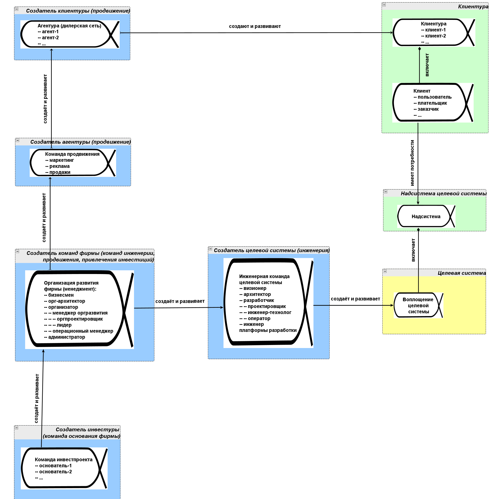

Нужно всегда понимать, о какой системе (целевой, в окружении, или
создающей) вы говорите в каждый конкретный момент --- ибо речь идёт о
вашем осознанном внимании к разным объектам, да ещё и к разным временам
в создании и развитии этих объектов. Например, когда вы просто
упоминаете «топор», то непонятно:

-   вы делаете топор (топор --- целевая система)?
-   вы используете топор для колки дров (целевая система --- дрова,
    топор --- «один из создателей»/«одна из систем создания»,
    необходимая для подготовки целевой системы-дров к эксплуатации ---
    сгоранию в печке)?
-   топор для вас одна из систем в окружении целевой для вас колоды,
    совместно с которой топор должен колоть дрова и свойства которого вы
    выясняете для того, чтобы спроектировать и изготовить правильную
    колоду^[<http://forum.rmnt.ru/threads/koloda-dlja-kolki-drov-nou-xau.102202/>]?

С самого начала обсуждения жизненных циклов и далее инженерных процессов
было понимание, что отдельные инженерные проекты по созданию систем
связаны между собой через время эксплуатации/использования в длинные
**графы** **создания**, ибо время эксплуатации создателя --- это когда
создатель участвует в работах по созданию какой-то очередной системы в
графе создания. Чтобы дойти в этом графе создания до создания целевой
системы, может понадобиться несколько шагов (я заточил топор, нарубил
дров и сделал из них костёр, добыл охотой дичь, запёк дичь в костре,
накормил готовым обедом семью --- и это очень простой граф создания,
целевая система в нём --- семья, я выступаю как провайдер обеда, но
чтобы произвести обработку семьи обедом мне требуется создать топор,
костёр и даже дичь как сырьё для обеда).

В эпоху распространнённых для описания жизненных циклов водопадных
«колбасок» был простой способ показывать даже не разветвлённые графы
создания, а простые цепочки создания для разового жизненного цикла: сам
жизненный цикл на них рисовался изображающими время полного жизненного
цикла стрелками с зарубками, отделяющими стадии/фазы жизненного цикла, а
отрезки времени эксплуатации каждой системы с работами по созданию
других систем показывались стрелкой-скобочкой на линии времени
жизненного цикла очередной системы в цепочке создания:

На таких диаграммах (её рисовать несколько секунд!) рассказывали истории
про цепочки создания типа «мы организуем стартап, который создаст САПР,
при помощи которого мы затем спроектируем топор, при помощи которого мы
потом будем колоть дрова, при помощи которых потом мы приготовим
обед» --- и для каждой системы в цепочке создания обеда в такой
диаграмме понятно, что она проходит довольно долгий период собственного
изготовления перед тем, как быть использованной/проэксплуатированной.
Недостатки такой картинки:

Если обсуждаем три системы, то картинка проста. Если систем не три, а
тридцать три, то с картинками работать невозможно --- нужны, например,
таблицы.

-   На картинке показаны стрелки по факту физического времени, хотя и
    предельно абстрактно представленного (одно из ранних пониманий
    жизненного цикла как «водопада» стадий/фаз/этапов работ, а не
    методов),
-   главное --- системы в этих «жизненных циклах» не просто разово
    вводятся в эксплуатацию, они продолжают модифицироваться по ходу
    эксплуатации, то есть после ввода в эксплуатацию продолжается
    стратегирование новых возможностей/фич, их проектирование,
    изготовление, инженерное обоснование успешности системы с этими
    фичами, интеграция в уже работающие системы, появляется множество
    версий системы.

Давайте вспомним об альфах, они вводились в курсе системного мышления
для того, чтобы показать как меняются состояния предмета метода в
проекте, причём в число состояний какой-то системы мы включали и
варианты, которые трудно представить при строгом использовании типов из
4D экстенсионализма --- для этого-то нам и потребовалась альфа, надо
было показать связность прохождения метода работ над какой-то цепочкой
онтологически разных объектов (скажем, альфа может представить состояния
«система в виде описаний», «система в виде сырья», «полусобранная
система», «готовая система на складе», «эксплуатируемая система»).

Так что перейдём для описания графов создания к языку не работ создания,
а методов создания: альфы --- это объекты отслеживания изменения
состояний предметов методов (предметы методов --- и системы, и
описания), ибо по ходу задействования методов создания систем альфы
меняют свои состояния, переходя от одних состояний к другим в графе
состояний объектов посредством выполнения каких-то методов работы.
Смотрите, тут уже были упомянуты два разных графа (создания и состояний
альфы), так что мы получили довольно выразительный язык для описания
проектов:

-   Граф состояний альфы, понимаемой как предмет метода. Метод переводит
    по мере выполнения работ свои предметы (альфы) из одних состояний в
    другие. Инженерный процесс (он же --- метод разработки) переводит
    замысел системы (например, в виде сценариев использования) в
    эскизный проект, затем рабочий проект, затем в изготовленную
    систему, затем в эксплуатируемую систему. Ну, или мы можем
    рассмотреть разложение метода на отдельные методы, которые выполняют
    переход между двумя состояниями в графе. Скажем, метод эскизного
    проектирования состояние «система замышлена» (оно же --- «замысел
    системы наличествует», оно же --- «концепция использования
    наличествует», использованная терминология тут может быть самой
    разной) переводит в состояние «эскизный проект системы
    наличествует».
-   Граф создания системы, создаваемый из систем-создателей и целевой
    системы проекта отношениями создания («топор создаёт дрова, охотник
    создаёт дичь, костёр из горящих дров создаёт обед из дичи»,
    «орг-архитектор создаёт орг-архитектурные решения для организации,
    орг-проектировщик создаёт оргпроект, используя орг-архитектурные
    решения, лидер создаёт согласно орг-проекту из набранных на рынке
    труда работников сотрудничающие оргзвенья для организации»).

Давайте представим виды систем, которыми занимается предприятие/фирма
(«которыми занимается» --- это ведь «работает по каким-то методам», то
есть эти виды систем будут предметами методов работы предприятия/фирмы):

-   Целевая система: система, которую производит фирма (возможно, из
    чужого сырья, если фирма --- провайдер сервиса)
-   Надсистема для целевой системы (у клиентов есть потребности как раз
    в надсистеме, в которой они хотят употребить целевую систему как
    часть)
-   Создатель целевой системы (команда инженеров, занимающаяся
    прикладной инженерией, например, программной инженерией, если
    целевая система --- это софт)
-   Создатель команд фирмы (который будет создавать команду инженеров и
    команду создателя агентуры, то есть команда менеджеров фирмы,
    занимающихся её развитием)
-   Создатель создателя команд фирмы, который не только создаёт
    инвестуру --- группу инвесторов, которые дают фирме необходимый для
    развития капитал, но и создаёт команду менеджеров по
    организационному развитию фирмы (то есть команда основателей фирмы,
    которая проводит соответствующие переговоры с инвесторами, оформляет
    инвестиционные сделки и организует/создаёт и развивает команду
    менеджеров)
-   Создатель агентуры, который создаст группу агентов по продажам
    (команда продвиженцев: маркетинг, реклама, продажи продуктов и/или
    сервисов фирмы)
-   Создатель клиентуры (агентура, то есть группа агентов, которая будет
    вербовать клиентов)
-   Клиентура (группа клиентов, у которых есть потребности в системе,
    они создают свои надсистемы и интересуются целевой системой)

Каждая из упомянутых систем меняет свои состояния, то есть может быть
представлена альфой как предметом метода, состояния которого нам надо
отслеживать в проекте. Эта альфа будет центральной в своей области
интереса (а всего там в этой области интереса будут минимум четыре альфы
по каждой системе --- воплощение системы, описание системы, методы
работы системы, работы системы). Это мы вспоминаем стандарт OMG Essence,
из которого мы взяли language (понятие альфы) и предлагаем собственный
вариант kernel (набор основных альф с их состояниями).

Пока нас интересует обсуждение графа создания. Поэтому покажем в каждой
области интереса только альфу системы и свяжем все эти системы
отношениями создания --- опустим пока показ описания, методов работы и
работ систем. При этом покажем отношения создания: фирма создаёт
агентскую сеть (агентуру), которая приносит клиентов (клиентуру), у
которых есть надсистемы, в которых и будет использоваться наша система.
Про основателей фирмы помним, но инвестуру (инвесторов, которых
основатели фирмы создают из владельцев свободных денег) прописывать не
будем. Задача: отмоделировать все эти альфы как объекты внимания в
предприятии, чтобы чего не забыть, когда мы меняем состояния этих систем
в предприятии.

Список систем, разложенных по областям интереса и связанный отношениями
создания --- как раз системная модель предприятия, хотя и крайне
упрощённая, и её будет достаточно, чтобы проводить довольно много
обсуждений предприятия, каждый раз отчётливо понимая, какую именно альфу
из области интересов к какой системе вы обсуждаете.

Когда мы рассматриваем системы попарно: создатель::система «создаёт и
развивает»::метод «свою систему»::система, то если «своя
система»::создатель, эту цепочку можно продолжить. А ещё один создатель
может создавать несколько систем, и цепочки в этот момент оказываются
графом.

Исключительно для иллюстративных целей приведём диаграмму графа создания
(в жизни вы будете создавать и заполнять списки и/или таблички, а не
диаграммы, ибо замучаетесь вносить постоянные изменения в диаграмму, но
про таблички расскажем чуть позже)^[Картинка высокого
разрешения ---
<https://ic.pics.livejournal.com/ailev/696279/215914/215914_original.png>]:

Все цепочки создания в графе создания так или иначе ведут к целевой
системе, но при желании можно показать, что целевая система тоже что-то
создаёт, она вполне может быть не последняя в цепочке (это легко может
оказаться станком, который купил у вас клиент --- и далее при помощи
станка оказывает сервис, создавая какую-то уже свою целевую систему). В
каждой альфе приведён для пущей понятности небольшой набор её подальф,
это шаг к конкретизации. Помним, что разложение методов --- это не
выделение частей и целых, поэтому нельзя говорить о том, что в общем
случае альфы как предметы метода соотносятся между собой как части и
целые, там отношение определяется как «если мы продвинули состояние
подальфы к более готовому, то состояние её альфы считаем тоже немного
продвинувшимся к готовности».

Цвета областей интереса взяты по мотивам стандарта OMG Essence:
относящиеся к целевой системе альфы даются на жёлтом фоне,
надсистеме --- на салатном фоне (клиентура как внешние проектные роли
имеет потребность каких-то характеристик надсистемы, которые может дать
целевая система в составе надсистемы, так что клиентура тоже попадает на
салатный фон), а вот команды-создатели в их цепочках даны на голубом
фоне. По большому счёту, мышление про все эти показанные системы в их
цепочках одинаково, так что цвет в рассуждениях оказывается не так
важен. Но можно его учитывать. Так, жёлтое --- это начало всех начал,
целевая система, и поэтому все рассуждения должны как-то приводить к её
созданию и улучшению, зелёное --- это системы и команды (внешние
проектные роли) вовне фирмы, а голубое --- это и есть сама фирма,
внутренние проектные роли.

В диаграмме показаны альфы как предметы методов, так что разговор идёт
функциональный, про огроли, а оргзвенья тут будут с точки зрения OMG
Essence рабочими продуктами (артефактами), по которым мы будем
определять состояние альф как функциональных объектов. И помним, что в
OMG Essence онтология кривовата (об этом предупреждалось ещё в курсе
системного мышления), ибо альфа нужна для удержания внимания на
состоянии каких-то объектов, а эти объекты могут менять свой
онтологический статус --- например, описания становиться системами,
наборы конструктивов становиться эксплуатируемыми уже собранными
системами и т.д., то есть это не состояния одного и того же объекта как
в физике («был объект тёплый, стал холодным»), нет. Это траектория
внимания, которое проходит по состояниям онтологически разных по типу
объектов, чтобы получить в итоге конечное/выходное состояние предмета
метода.

Любителям абсолютной онтологической строгости с альфами приходится туго,
но мы не будем тут что-то сочинять своё, а будем задействовать
язык/language/дисциплину OMG Essence, ибо этот стандарт как раз
предназначен для описания инженерных процессов и какого-то их
упрощённого разложения (рабочие процессы --- это методы работы, поэтому
используем тут метафору разложения в спектр).

Мы не советуем использовать предлагаемую этим стандартом нотацию (как
текстовую, так и диаграммную) и предложенный в нём набор областей
интереса и альф (в языке стандарта это kernel, «основные альфы»). Не
нужно копировать наши диаграммы из курса, не нужно даже рисовать такие
свои диаграммы, а хоть и адаптированные. Но нужно будет прописывать ваши
варианты графов создания для вашего проекта, а также описывать состояния
альф из этих цепочек создания в табличках в каком-то универсальном
моделере. И этот моделер должен быть ещё и не ваш любимый, а в качестве
моделера вы должны брать операционный софт тех людей, которые будут идти
по описываемым вами методам работы. Как это делать, будет рассказано в
нашем курсе дальше.

Моделирование графа создания заставляет ответить на множество вопросов.
Например, мы (кто мы? Команда, коллектив команд, предприятие? Владельцы,
менеджеры, инвесторы?) создаём софтверную компанию, которая разработает
софт ведения общей модели данных в ходе строительства моста, проектный
институт предусмотрит этот софт при проектировании стройки, а стройка
будет эксплуатировать этот софт, когда будет строить мост. А целевая
система? Мост, как провайдер сервиса пропуска транспортного потока, эту
цепочку создания можно продолжать! И придётся тщательно проработать всю
эту цепочку создания (она тут ещё и не вся прописана! Создателей в самых
разных цепочках, и даже не столько цепочках, сколько графах создания тут
много больше). Если вы не научитесь моделировать и документировать такие
цепочки, каждый раз доводя их до целевой системы, то вы будете вынуждены
находиться в клубке бесконечных обсуждений того, чем же вы занимаетесь в
рамках какой-то невнятно «тусующейся» толпы самых разных людей из самых
разных служб самых разных компаний со всеми важными и неважными деталями
описания. Плохо будет понятно, чем из всего обсуждаемого нужно
заниматься, и нужно ли вообще этим заниматься. Если вы моделируете и
документируете граф создания, то вы очень быстро говорите, зачем и
почему нужен ваш проект по созданию и развитию вашей системы (обычно он
где-то в середине какой-то из цепочек создания в графе создания), как он
приведёт к успеху целевой системы (ну, или понимаете, что проект не
влияет на успех целевой системы, поэтом никому кроме вас не нужен, и
закрываете этот ваш бесперспективный проект).

**Чем дальше** **в графе** **создания** **вы находитесь** **от целевой
системы, тем больше внимания вам нужно** **ей уделять: от вашего
мышления потребуются усилия, чтобы удерживать её во внимании. Системное
мышление** **требует собранности: найти целевую систему, а после этого**
**спроектировать и обосновать всю цепочку** **создания** **до**
**«вашей»** **системы, не пропуская ни одной системы в этой цепочке и
удерживая во внимании пользу всего проекта для целевой системы.** **Без
собранности у вас не получится не терять из виду целевой системы. Совет
тут обычный для усиления внимания: документируйте** **граф создания!**
**Это поможет удержать внимание к целевой системе.**
