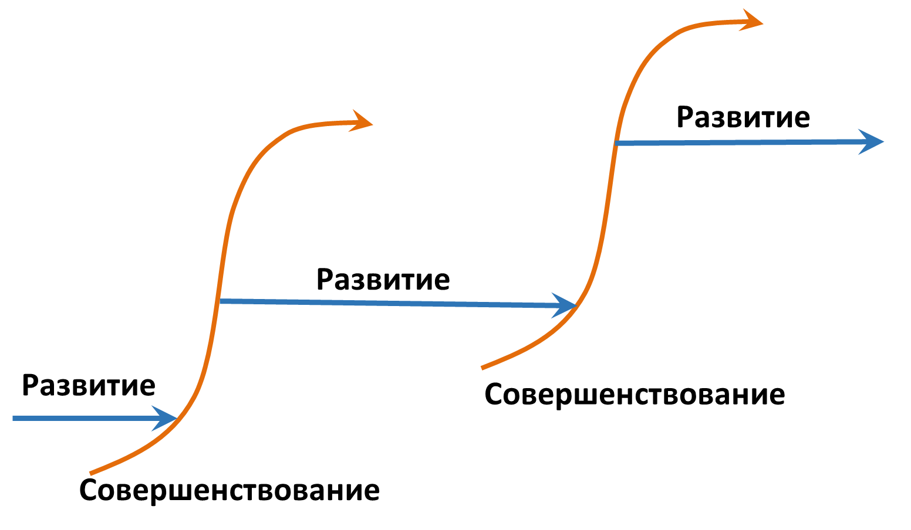
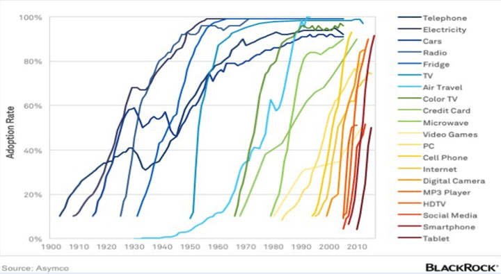

Disruption technologies принято переводить как **подрывные
технологии**^[В отличие от breakthrough technologies,
прорывных технологий, которые означают просто новинки, «то, чего раньше
нельзя было сделать, и вот получилось».] --- это такие
технологии, которые закрывают одни отрасли и открывают другие. Типичная
такая цепочка --- это телеграф, который был подорван технологией
проводного телефона, который был подорван технологией сотового телефона,
который был подорван технологией смартфона, и дальше через чаты
происходит возврат к телеграфу, а звонки всё больше групповые
видеозвонки. Виниловые пластинки стали CD-дисками, а потом и вовсе
превратились в сетевые музыкальные сервисы. Гибкие магнитные диски
появились, уступили место «флешкам» буквально на несколько лет, а затем
и флешки исчезли из употребления, данные передаются через облачные
сервисы.

Каждый такой «подрыв» --- это исчезновение одних массовых видов работ,
требующих мастерства в уходящей технологии и приход новых видов работ,
требующих мастерства в приходящей технологии. Десятки и сотни тысяч
людей, а то и миллионы занятых в подорванных технологиях вынуждены были
переучиваться. Сейчас это происходит с нарастающим масштабом, и
увеличивающейся скоростью.

Кто помнит извозчиков? Буквально за 13 лет с 1900 по 1913 год гужевой
транспорт в Нью-Йорке был заменён автоперевозками, с чего Tony Seba и
начинает свою серию презентаций в 2014 году^[Версия
доклада 2018 года (видео 37 минут): <https://youtu.be/KVm74yE0aUE>,
пересказ доклада 2016 года по-русски:
<http://tv2.today/TV2Old/Budushchee-uzhe-nastupilo-lekciya-andreya-pozdnyakova-0>],
которую потом он повторял и уточнял вплоть до 2020 года, когда тренд с
электромобилями стал уже всем очевиден^[А в 2021 году
переключился на изменения в энергетике, они не менее драматические: на
наших глазах стремительно исчезают угольные электростанции, шахтёры
остаются без работы! Вот его видео:
<https://www.youtube.com/user/tonyseba/videos>]. Но это в
мегаполисе, в Нью-Йорке. А в целом по США с 1910 по 1920 всего за десять
лет доля пассажиро-километров на автомобилях была поднята с 11% до 81%.
Для этого была построена автомобильная промышленность, развёрнуты
производство бензина и сеть автозаправок --- и это в то время, когда
страна отвлекала ресурсы на участие в первой мировой войне.

Лучшая на сегодня бизнес-теория техно-эволюции (то есть объяснение «где
деньги во всём этом бурном прогрессе») создана Tony Seba. Вам нужно
просмотреть его короткие видео, которые вышли в конце 2022
года^[<https://www.youtube.com/watch?v=z7vhMcKvHo8>,
<https://www.youtube.com/watch?v=Vqs0_3M-18c>,
<https://www.youtube.com/watch?v=fsnkPLkf1ao>,
<https://www.youtube.com/watch?v=g6gZHbfK8Vo>], и дальше
обратиться к его книгам (они упоминаются в этих видео, хотя не ожидайте
там какого-то очень точного рассказа: как бы ни был прозорлив Tony Seba,
предсказать будущее не может и он, тем более что затронуты оказываются
все сферы жизни).

Истории подрыва/disruption можно рассказывать о секретарях-машинистках и
машинописных бюро. Об операторах ЭВМ в эпоху мейнфреймов. Веб-мастера на
старте интернета просуществовали буквально несколько лет. Из массовых
профессий буквально сейчас стремительно уходит профессия кассира,
магазины без кассы в мире уже появились и потихоньку распространяются,
одновременно безналичные расчёты резко сократили затраты времени
нынешних кассиров --- и людей на кассе теперь нужно меньше при сравнимой
длине к ним очереди.

Можно ли назвать занятость, приходящую и уходящую на несколько лет
«профессией»? Нет, нельзя. Это просто «занятость», практикование
какого-то мастерства. В долгой жизни можно стать мастером во многих
деятельностях, но необязательно каждый вид своего мастерства называть
«профессией». То же самое относится и к фирмам, ни одна фирма не может
гарантировать себе «профессию» и позицию на рынке на долгие годы. С июня
по ноябрь 2022 Amazon потеряла один триллион долларов в капитализации.
Microsoft недалеко ушла, потеря примерно \$0.9 триллиона. Всего 5
крупнейших технологических компаний США потеряли вместе четыре триллиона
долларов^[<https://gizmodo.com/amazon-market-cap-amazon-prime-e-commerce-1849764529>].
Это больше, чем совокупный ВВП Турции, Аргентины и Швейцарии. У
лидирующей социальной сети была капитализация больше триллиона долларов,
компания входила в первую пятёрку компаний мира по своей капитализации,
а теперь не входит даже в верхние 20, капитализация всего \$270
миллиардов (немало, но 16 месяцев назад это было чуть ли не вчетверо
больше)^[<https://www.cnbc.com/2022/10/27/meta-is-no-longer-one-of-the-20-biggest-us-companies.html>].

Все эти технологические подрывы и связанные с ними сценарии вынужденного
переучивания миллионов людей, вызваны одной и той же причиной:
экономикой экспоненциальных технологий в части целевых систем и их
оценкой со стороны бизнеса.

В **экспоненциальных технологиях** цена технологии нелинейно (в
полтора-два раза за год) падает. Поскольку цена падает по экспоненте, то
изделия и сервисы этих технологий начинают покупать в больших масштабах.
Распространённость новой технологии следует закону S-образной кривой, в
которой есть участок буквально взрывного, экспоненциального роста --- а
потом просто становится некому продавать, все уже имеют эту технологию.
Но тут обязательно появляется новый «неожиданный» подрыв --- и всё
повторяется: сначала дорого и у немногих, потом очень дёшево, и у всех.
Так что кривая падения цены --- экспонента, а кривая распространения
технологии --- логистическая, она же S-curve.

Ничего линейного в будущем нет, это цепочка «неожиданных» (на самом деле
вы должны это ожидать!) экспоненциальных подрывов --- и в каждом таком
подрыве есть период с «ничего вроде не происходит» с последующим
периодом «неожиданно всё стремительно». Вкладываться в устаревшую
технологию становится неправильно по чисто экономическим соображениям, и
происходит шаг развития --- переход к новой технологии, у которой
совершенно другой потенциал развития. Это и есть большой
техно-эволюционный переход (major techno-evolutionary transition),
причём всё происходит быстро за счёт того, что мемом (информационные
модели технологий, сегодня ведь даже бумажных чертежей нет, а только
информационные модели, по которым непосредственно и часто в
автоматическом режиме изготавливается огромное число воплощений
описанных систем с определяемым этим мемомом феномом) отделён от целевой
системы, и в нём идут умные мутации, а не происходит медленная
дарвиновская биологическая эволюция.

Главное тут то, что самые разные «экспоненциальные технологии», каждая с
каким-то своим «законом» (то есть коэффициентом к экспоненте, чаще всего
этот «закон» называют по имени инженера, определившего этот коэффициент)
кратного падения цены за год складываются вместе в одной результирующей
технологии, и в этот момент начинается подрыв: эта технология
стремительно распространяется, её использование в силу дешевизны
вырастает кратно в год.

На картинке показана скорость распространения новых технологий. Видно,
что чем позже появляется технология, тем быстрей она распространяется.
Первый успешный смартфон (iPhone) появился в 2007 году, чуть больше
пятнадцати лет назад. Первый планшет (iPad) --- в 2010 году, чуть больше
десятка лет назад.

Почему iPhone появился в 2007 году и имел сразу такой успех? Потому что
в этом продукте сошлись множество других экспоненциальных технологий:
экспоненциально падала стоимость транзистора в чипе (закон Мура), бита
во внешней памяти (закон Кридера), числа пикселей в матрице камеры
(закон Хенди), передачи данных (закон Баттера), а ещё сенсорный экран,
литий-ионные аккумуляторы, GPS и датчики акселерометра. И когда всё это
стало достаточно дешёвым и слиплось в один продукт за \$600, он
«взлетел». Помним, что Apple пыталась запустить до iPhone абсолютно
инновационный наладонный компьютер Newton, это был 1993
год^[<https://ru.wikipedia.org/wiki/Apple_Newton>].
И ничего не получилось: технологии были ещё не готовы, они уже все были
в наличии, но слишком дорого стоили. И речь идёт о продуктах, в которых
этих разных стремительно дешевеющих технологий много. В какой-то момент
цена самых разных составляющих падает в разы, стоимость самого сложного
продукта падает (неожиданно для всех) в разы --- и он мгновенно
разлетается по планете.

Через пару лет после появления смартфона в 2009 году появился Uber, он
предложил бизнес-модель заказа такси с использованием смартфона и
облачных вычислений, и через 7 лет (в 2016 году) число заказов через
Uber стало больше, чем во всех таксомоторных парках США. Через 8 лет (в
2017 году) Uber и Lyft с начального нуля получили 20% от всего объёма
перевозок (в милях) в таких городах, как Сан-Франциско и Нью-Йорк. А в
декабре 2020 Uber продал своё подразделение автопилотируемых
автомобилей^[<https://www.bbc.com/news/business-55224462>] ---
там уже несколько лет ожидалось экспоненциальное развитие, но его не
случилось! Самоуправляемые/беспилотные/автономные автомобили находятся
пока на начальной стадии S-образной кривой. А потом? А потом, через
несколько лет будет традиционное --- «ах, когда же это всё успело
произойти?!». Разговоры вдруг станут реальностью, и ключевое тут будет
слово «вдруг», ведь роботакси без водителя уже доступны широкой
публике^[<https://www.fox10phoenix.com/news/waymo-self-driving-ride-hailing-service-now-available-in-downtown-phoenix>].

Эти нелинейности и неожиданности моментов использования одних технологий
в составе других и последующего стремительного распространения
появляются за счёт чисто экономических причин: экспоненциального падения
стоимости новаций, и массовых закупок вдруг «внезапно» подешевевшей
технологической роскоши. Тут нет никаких «планов развития инноваций» от
правительств, или ещё каких-то других конспиративных теорий, реализации
чьих-то долгосрочных планов. Кто мог предсказать появление смартфонов и
дата-центров по приемлемой для широких масс цене? Кто мог без этих
дешёвых смартфонов и дешёвых дата-центров сделать аналог Uber?

Никакие эксперты не в состоянии предсказать будущее: каждая из
технологий неочевидным образом снижает цены и делает доступными
огромному количеству людей те технологии, в состав которых они входят. А
если и не снижается цена, то при той же цене можно получить
характеристику в разы лучше. Пять лет назад за \$2000 можно было купить
ноутбук с 8Gb памяти, 4 ядрами процессора и FullHD дисплеем. Сегодня за
ту же сумму можно купить ноутбук с 32Gb памяти, 8 ядрами процессора и 4К
дисплеем. И ещё там будет 1Tb твёрдотельный «диск» (который уже давно не
диск!). Такие ноутбуки, какие были 5 лет назад, стоят \$1000, вдвое
дешевле, а то и меньше. «Вдвое за пару лет» гласит закон Мура по поводу
числа транзисторов на микросхеме --- это начальник службы исследований и
разработки компании Fairchild Semiconductor Гордон Мур сформулировал ещё
в 1975 году, он предположил тогда, что так будет ещё лет десять. Но это
было 46 лет назад! Сейчас скорость падения цены по закону Мура немного
уменьшилась, но закон до сих пор продолжает действовать. И даже «вдвое
за четыре года» вместо «вдвое за два года» --- это тоже экспонента, и
это тоже очень быстро!

Tony Seba называет склейку разных экспонент в одном продукте
«конвергенцией». «Подрыв подо всей цивилизацией» происходит из-за
конвергенции самых разных технологий в одной. Так, в автомобилях
происходит конвергенция технологии аккумуляторов с созданием гигафабрик
для их выпуска (и поэтому становятся возможными электромобили), и
технологий автопилотирования, требующих развития как аппаратных средств
искусственного интеллекта (специальные компьютеры с ускорителями для
умножения матриц), так и алгоритмов, так и датчиков для ориентации
автомобиля в пространстве. А ещё отработана технология замены алгоритмов
через интернет, не надо приезжать на станции техобслуживания.

Быстрое распространение подрывных технологий можно очень приблизительно
разделить на следующие
стадии^[<https://arxiv.org/abs/1905.13178>]:

-   стандартизация (standardization, возникновение промышленных
    стандартов, позволяющих организовать встраивание новой технологии во
    внешние системы). Если вы обнаружили перспективную технологию, в
    которой ещё нет стандартов, то вам повезло: вы близки к началу её
    распространения.
-   удобство использования (usability, обеспечение удобного интерфейса к
    технологии, иногда речь идёт о «ключевом приложении», killer
    application)
-   переход в массовое потребление (сonsumerization)
-   переход в инфраструктуру (foundationalization, «изо всех утюгов»,
    «потребление незаметно»).

В компьютерах сначала появились открытые архитектуры (стандартизация),
затем графические интерфейсы (удобство использования), потом они стали
потребительским товаром (iPhone и магазин приложений), а теперь основной
компьютинг идёт вообще в инфраструктурных организациях --- дата-центрах.
Интернет начался со стандарта HTML (стандартизация), затем появилось
удобное его использование (разделение оформления и содержания страниц
через стилевые описания CSS), затем появились социальные сети, а сейчас
по факту интернет стал основой для большинства рабочих, промышленных и
торговых коммуникаций. В AI стандарты уже появились (например,
ONNX^[<https://onnx.ai/>]), удобство
использования --- это голосовые и чат-интерфейсы, это пока только
появляется, так что ещё ждём перехода к массовому использованию (по
аналогии с интернетом это может быть ситуация, в которой AI создаются
самими пользователями, а не специалистами), и некоторое время ещё нужно
ждать до инфраструктурности.

Эти все этапы довольно быстро пробегаются самыми разными технологиями.
