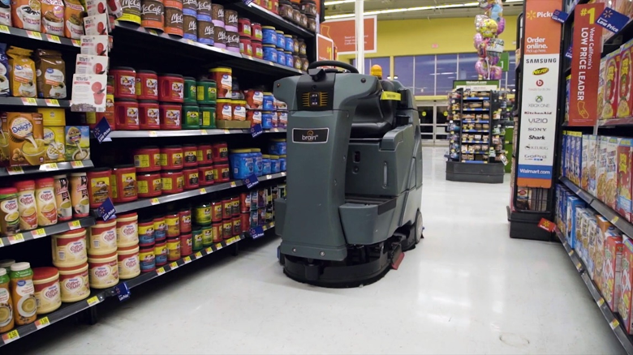
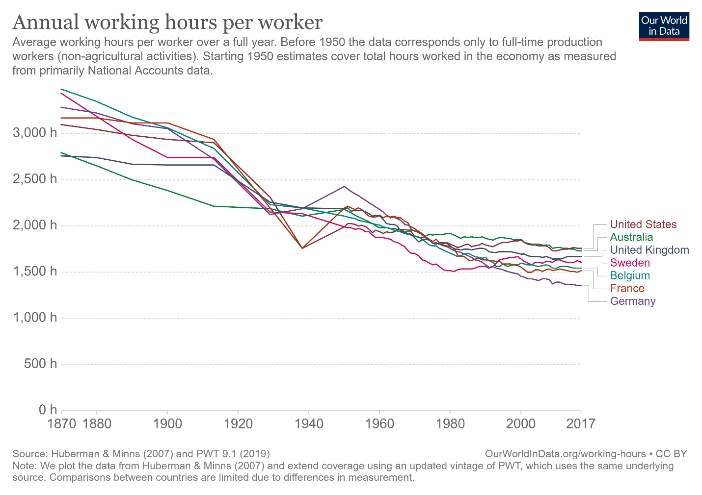

Учитываем, что на первом месте отслеживаемых Tony Seba экспоненциальных
подрывных технологий --- машинный интеллект. Он занимает особое
положение, потому как он может быть направлен на улучшение самого себя,
«компьютерные программы, которые пишут компьютерные программы».

Tony Seba особо отмечает, что развитие машинного интеллекта не
экспоненциально, а гиперэкспоненциально. Похоже, что он прав.
**Использован машинный интеллект может быть так же, как и любой
человеческий интеллект: везде, где используется интеллект людей.
Интеллект универсален, нет закрытых от него сфер. Как эта**
**гиперэкспоненциальная** **подрывная технология повлияет на мир,
предсказать нельзя --- как нельзя предсказать, как именно повлияет на
мир интеллект естественный. Это покрыто туманом будущего.**

Изменения в мире произойдут стремительно. В древнем отчёте 2017 года от
McKinsey в 2030 году ожидалось, что 400-800 млн. нынешних рабочих мест
будут автоматизированы, труд на этих местах существенно изменится
(читай: «исчезнет в его текущем виде»). Как раз о таких отчётах Tony
Seba предупреждает в своих презентациях и книгах: они недооценивают
масштабы перемен в разы из-за неучёта экспоненциального характера
затрагиваемых ими технологий. **Автоматизация к 2030 году коснётся
миллиардов рабочих мест, хотя в мире население всего 8 млрд. человек.
Помним, что в телефоны у миллиардов людей в кармане никто тоже не верил,
в интернет у миллиардов людей в кармане тоже никто не верил, в
автоматизацию труда миллиардов людей пока тоже не верят, а зря. То, что
сейчас говорят «цифровая трансформация», а иногда и
«гиперавтоматизация», ничего не меняет: это всё маркетинговые замены
термина, но суть дела остаётся: человеческий труд повсеместно заменяется
машинным, как физический труд, так и умственный.**

Скорость таких изменений надо учитывать и в личном стратегировании, и в
корпоративном: если что-то связано с технологиями искусственного
интеллекта, то развитие событий будет, скорее всего быстрее, чем
ожидается. Пока внимание широкой публики привлекают нейрохудожники,
примерно такого же масштаба изменения происходят и во многих других
областях, в том числе в «реальном секторе» (то есть производстве товаров
и сервисов, которые нельзя передать по оптоволокну).

Почему применяют роботов, а не людей? Часто не потому, что роботы не
болеют, не уходят в отпуск, не спят, а работают быстрее. Нет, **роботы
работают лучше, чем люди --- часто настолько лучше, что делают
недостижимое людьми (быстрее, точнее, меньше ошибок), плюс меньше
отвлечений при решении рутинных задач и отсутствует время для отдыха.
Это как замена землекопов экскаваторами, только в качестве землекопов
выступают люди самых разных профессий.**

Так, с января 2019 в Walmart вместо уборщиков вышли 360 роботов фирмы
BrainOS, в апреле к ним добавили ещё 1500. Эти роботы убирают лучше и
быстрее, управляя обычными уборочными машинами, плюс их не нужно часто
нанимать и дополнительно учить (среди уборщиков в год меняется от 30% до
100% персонала. И всех этих новеньких нужно найти, нанять, обучить --- с
роботами этого не нужно, их покупка, ввод в эксплуатацию и настройка
занимают меньше времени). Чтобы покупатели не катались на этих машинах,
место водителя на них отгораживают жёлтыми
ленточками^[<https://www.braincorp.com/newsroom/brain-corp-to-expand-ai-services-in-retail-industry>].
А ещё 600 роботов BrainOS в 2022 вышли на работу по сканированию
товарной
выкладки^[<https://roboticsandautomationnews.com/2022/10/27/walmart-makes-brain-corp-the-worlds-largest-supplier-of-inventory-scanning-robots/55342/>].
Всего только на этой платформе роботов на конец 2022 года выпущено было
26 тысяч роботов, которые проработали 9 миллионов часов в автономном
(без участия человека)
режиме^[<https://braincorp.com/>]. Если
считать, что один робот заменяет одного человека (что не совсем так), то
это небольшой городок. А ведь речь идёт только об одной
робототехнической фирме!

И это даже не единственное использование роботов в магазинах, сами
магазины становятся роботами (из них исчезают в том числе и кассиры,
контролем наличия товара на полках занимаются роботы, и всё остальное
тоже переходит к
роботам)^[<https://www.roboticsbusinessreview.com/opinion/robots-will-transform-retail-operations-in-2021-heres-why-how/>].

Это нормально, этого не нужно бояться. Ещё недавно 90% людей были заняты
сельским хозяйством, а сегодня --- именно благодаря машинам --- осталось
всего 3% «крестьян» (хотя работников современных ферм меньше можно
назвать «крестьянами», они больше похожи на заводских работников по
стилю их жизни и виду занятий). Несмотря на это, все высвободившиеся из
сельского хозяйства люди оказались заняты, даже с учётом того, что число
людей на Земле сильно подросло! Более того, и пролетариата, заводских
рабочих, сегодня тоже не так много, как ещё полвека назад! А бедность,
тем не менее, существенно в планетарных масштабах уменьшилась.

Основная ошибка рассуждений на тему «роботы отберут работу» в том, что
**количество работы в мире не константа, постоянно появляется новая
работа по мере вовлечения в деятельность людей всё новых ресурсов и
бесконечного развития технологий.** Все эти заявления «роботы заберут
работу у людей» --- пугалки из ненаучной фантастики, фэнтези. Люди (а
через некоторое время люди с машинами) придумывают себе и машинам всё
новые и новые занятия вместо тех, от которых их освободили машины, сумма
труда в мире с распространением каждой подрывной технологии только
растёт. И прежде всего уходит самый тяжёлый, неблагодарный, опасный
труд.

Есть ещё и резерв увеличения свободного времени, которое можно потратить
и на просто отдых, и на развитие/образование: люди радуются, а не
печалятся, что «электричество и машины отняли работу». Одну работу
отняли, пять других дали!

Этот тренд на сокращение рабочих часов для нормальной жизни проявляется
и в росте свободной занятости (freelance, gig economy, platform
economy^[<https://en.wikipedia.org/wiki/Gig_worker>])
с использованием для поиска работы онлайн-платформ для самых разных
видов мастерства. Есть даже платформы для оплаты меценатами чьих-то
хобби (patronization). Если ты мастер в каком-то хобби, то тебе за это
могут заплатить! Хобби и работа постепенно теряют чёткую границу между
ними, спорт (демонстрация того, что человек не утратил качества
обезьяны --- быстро бегает, хорошо дерётся, далеко кидает тяжёлые
предметы, умеет командой загнать никому не нужный мяч в ворота при
противодействии другой команды, и т.д.) стал для профессиональных
спортсменов работой, а для миллиардов людей развлечением --- вместо
чтения книг, просмотра художественных фильмов или хотя бы какой-то
физической активности (бег трусцой, танцы). Киберспорт продолжает эту
традицию и тоже стремительно профессионализуется. Шоу-бизнес --- это
тоже бизнес, это не художественная самодеятельность, это серьёзные
деньги. Праздной публике в Риме, как мы помним, нужно было хлеба и
зрелищ, игнорировать это нельзя. Чем больше избыток хлеба, тем (при
отрицательной полезности труда, помним об этом!) больше желание
развлечений --- и избыток средств люди будут тратить на это.

Тем не менее, **автоматизация и добычи хлеба, и добычи развлечений
гарантирует вам частую смену работы: вам не удастся много и долго
заниматься в жизни одним и тем же делом, даже если вы перешли работать
из реального сектора в сферу развлечений, удерживаться на работе долго
точно невозможно ни фирме, ни человеку!** Старая работа будет
существовать некоторое время, а затем «неожиданно» подрываться и
исчезать по самым разным причинам, поэтому и вам, и вашей компании нужно
будет постоянно задействовать своё умение делать что-то новое. **Нужно
будет регулярно вписываться в новые проекты, занимать какое-то место в
чужой цепочке создания. Если вы этого не умеете, то придётся научиться,
то есть приобрести какой-то уровень интеллекта как способности решать
проблемы, которые раньше не встречались.**

Подчеркнём ещё раз, что все эти рассуждения о неминуемой безработице
безмасштабны: они относятся к ролям частей личности, к личности, а также
к команде, коллективу (команде команд), организации в целом. Если
организация вовремя не поменяла людей на машины, то конкуренты
обязательно используют машины --- и продукция организации будет или
хуже, или более дорогой (или и хуже, и более дорогой одновременно). И
людей всё равно придётся уволить, но уже может быть вообще всех, а не
только тех, кого нужно было заменить роботами. Но если вы много
автоматизируете, и больше, чем конкуренты, то парадоксально, но вы
будете расти --- скорее всего, вы будете не увольнять людей, а нанимать
их.

Если в организации в ходе автоматизации/цифровой трансформации
высвобождаются люди, необязательно сохранять им рабочие места.
Высвобожденные люди найдут себе новую работу, и не обязательно внутри
этой же организации, хотя если она быстро растёт, это вполне возможно.
Уволенные не останутся безработными! Это не ответственность организации
трудоустраивать всех высвободившихся работников, это их ответственность
находить себе работу и быть достаточно обученными для этого!
