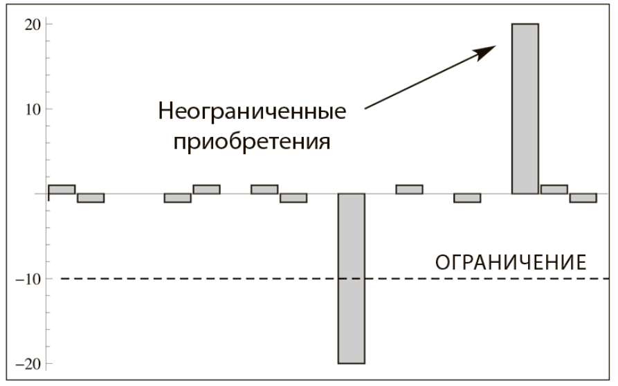
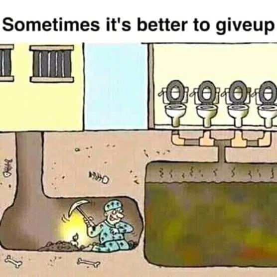
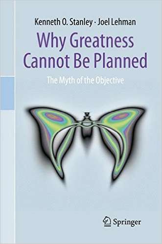
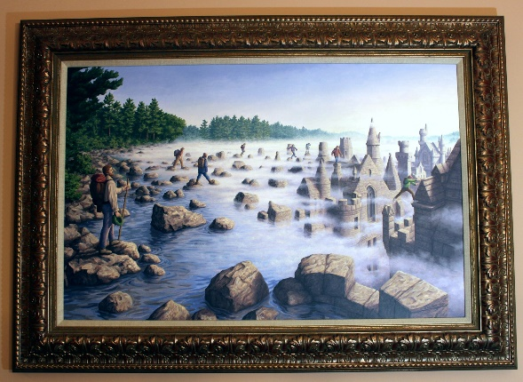
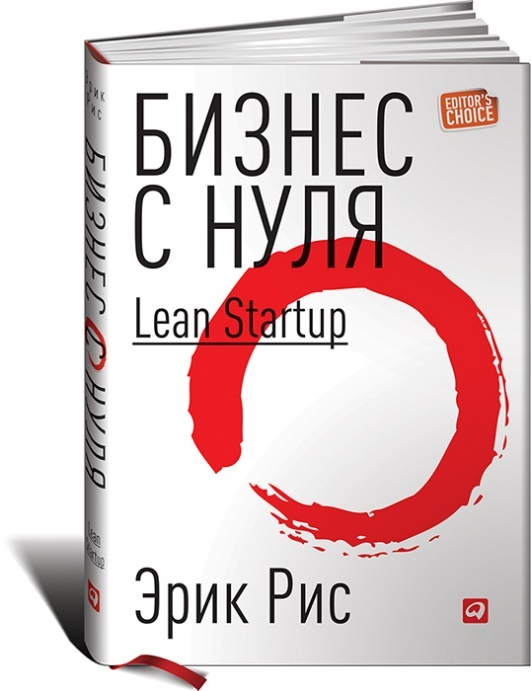
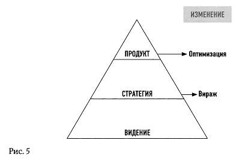

Если вам стыдно, что вы ещё не нашли смысла жизни, у вас нет
долгосрочных планов, вам трудно сформулировать мечту --- познакомьтесь с
литературой, обсуждающей порочность долгосрочного мечтательного
целеполагания. Такой литературы сегодня много, и это счастье. Раньше
таких книжек не было, всех поголовно уговаривали выбрать «дело жизни»,
желательно в раннем детстве. Люди страдали, если у них не обнаруживалось
цели в жизни, или эту цель в жизни приходилось менять каждые несколько
лет. А страдать не нужно, это ведь нормально! Концепт «цель жизни» и для
людей, и для компаний (только там говорят «цель существования», а не
«жизни») --- придуманный, он абсолютно искусственный, в нём нет ничего
естественного **В стратегировании вы должны вовремя замечать, что цели
жизни у вас и цели существования компании неадекватны изменившейся
ситуации --- и заменить их! Никаких «скреп», «заветов
предков/основателей», «детской мечты», «столетней традиции». Жизнь
изменилась --- меняй цели, хоть личные, хоть корпоративные.**

Интуиция подсказывает, что **в текущей ситуации непрерывных
технологических подрывов лучше долгосрочных целей не ставить, ибо это
всё равно бесполезно, вы этих целей не достигнете, это будет источник
постоянного расстройства.** Но художественная литература вроде как
требует такие цели иметь. Что делать?

Тут ещё нужно сказать, что само понятие «цель» размыто в своём значении.
Например, есть устойчивое сочетание «цели и задачи» --- и пытаются
изобрести, чем «цели» отличаются от «задач». Или чем «цели» отличаются
от «миссии» и «видения». Или чем «цели» отличаются от стратегии.

Мы считаем, что тут говорим о долгосрочной стратегии, ибо стратегия
подразумевает множество самых разных моделей, которые позволяют
согласовать предметы интереса многих ролей (внутри личности, если речь
идёт о личном стратегировании, или внутри организации, если это
корпоративное стратегирование).

Поэтому от «долгосрочных целей» переходим к разговору о стратегии.

**Нужно просто часто обновлять (изменять частично, изменять полностью,
то есть делать «вираж»/pivot) стратегию. Стратегирование должно быть
непрерывным, не прекращаться. Круто не меднолобо преследовать всю жизнь
детскую мечту (личную или корпоративную), но всю жизнь развиваться
самому и развивать мир вокруг себя, на многих системных уровнях.
Бесконечно развиваться, преследуя самые разные цели развития --- это
много круче, чем быть романтиком-фанатиком** **и** **тем более пытаться
сделать из компании романтика-фанатика, то есть слепо преследовать
долгосрочную мечту!**

А как же с мечтой типа «послать оранжерею на Марс», которую лелеет тот
же Элон Маск? Это отнюдь не детская его мечта. Эта мысль у него
появилась, когда он был уже миллионером. И эта мысль не мешает ему
заниматься самыми разными проектами, которые подворачиваются под
руку --- и электромобилями, и транспортными туннелями, и солнечными
панелями, и спутниковой связью, и даже Твиттером. Одно дело
«нарисованный пиарщиками образ», другое дело --- реальные дела. Тут тоже
есть «схемы»: что реально происходит, и как это подаётся широкой
публике. Но да, «хотелка» летать на Марс у Маска есть. Почему бы и нет.
Одна из множества «хотелок», отнюдь не всепоглощающая страсть. Так что
не надо стыдиться разнообразия своих проектов, это нормально. Быть
меднолобым фанатиком одной идеи --- вот это неправильно. Успевайте
заметить, что вы застряли на уже неактуальной стратегии, что застряла
ваша организация --- и срочно меняйте цели, меняйте стратегию!

Пожалуй, самая известная книжка из литературы по постановке
краткосрочных жизненных и корпоративных целей и избеганию
долгосрочных --- это «Антихрупкость» Нассима
Талеба^[[https://www.amazon.com/Антихрупкость-извлечь-выгоду-Азбука-Бизнес-Russian-ebook/dp/B0156M8ISC/](https://www.amazon.com/Антихрупкость-извлечь-выгоду-Азбука-Бизнес-Russian-ebook/dp/B0156M8ISC/)].

Описанный в книжке идеал --- быть «рациональным
фланёром^[[https://ru.wikipedia.org/wiki/Фланёр](https://ru.wikipedia.org/wiki/Фланёр)
--- городской тип, впервые отмеченный в Париже середины XIX века (также
*boulevardier*). *Фланирование* означало гуляние по бульварам с целью
развлечения и получения удовольствия от наблюдения городской
жизни.]», который пересматривает свой маршрут на каждом
шагу, чтобы сделать его зависимым от полученной новой информации. Это
ключевой момент: никогда не планировать «в будущее» на расстояние
больше, чем один шаг. Никогда не бежать «куда», не иметь долгосрочной
цели, которую вы хотите достигнуть. Нужно всегда бежать «откуда»,
отталкиваясь от того, что вам уже известно. На следующем шагу будет
известно больше, меняйте цели, делайте новые ставки.

Это хорошо соответствует теории active/embodied inference, где агент
(личность, организация, сообщество, что угодно) избегает неприятного
сюрприза (выживает, старается быть стабильным), а не стремится к
какой-то особой цели. Если всё вокруг хорошо, то речь идёт о
предсказании: важно обеспечить, чтобы предсказание тоже говорило, что
всё будет хорошо! И для этого соответствия предсказания жизни чем надо
будет заняться в плане изменения агентом окружения и себя, а также
изменения моделей окружения и себя, тем и придётся заниматься. Это
полностью соответствует тому, что говорит мизевская праксеология:
действовать человека заставляет чувство неудовлетворённости,
беспокойства от возможных в будущем проблем. Жизнь меняется, меняется
предсказание возможных проблем, меняется предсказание лучшего способа
ухода от этих проблем, предсказание лучшего способа добычи ресурсов для
ухода от проблем. Поэтому стратегия будет меняться!

Не нужно быть рабом собственной мечты и уверенности. Долгосрочная мечта
призрачна, она обманет. Не чувствуйте вины от того, что вы и/или ваша
компания «поменяли мечту»^[Вот мемуар, сделанный под
влиянием предыдущей версии нашего курса,
<https://danielko.medium.com/musings-of-tech-space-enthusiast-part-i-428c28655b44>.
Автор мемуара (Даниэль Корнев) радуется, что у него пропало чувство вины
от того, что он недостаточно жёстко много лет преследует одну и ту же
мечту. Оказывается, мечту просто можно время от времени менять, чтобы
оставаться современным! И никакого чувства вины при этом, наоборот ---
радость от того, что остаёшься современным!]. Идите за
**текущим** интересом, ибо ваш интерес тоже может меняться.
**Фланируйте, доверяйте интуиции. Но фланировать нужно рационально, не
делать очевидных ошибок.**

В книжке Талеб формулирует, что «ставить нужно на всё что угодно», ибо
никто не знает, где лежит твоё счастье --- будущее принципиально
непредсказуемо. Но нужно быть «лохом»^[Слово,
использованное в переводе книги,
[https://ru.wikipedia.org/wiki/Лох\_(жаргонизм)](https://ru.wikipedia.org/wiki/Лох_(жаргонизм))],
чтобы ставить на реализацию мечты, которую можно осуществить только
через много-много не просто рискованных, но вообще непонятных шагов:
когда у вас нет никакой идеи о том, какова концепция системы, которую вы
создаёте, и нет идеи о том, существует ли в мире аффорданс
(конструктивная часть, которую вы можете использовать для реализации
функции, без которой система не заработает).

На рисунке 24 в книге Нассим Талеб приводит картинку «штанги» во
временном ряду, как главного способа достижения успеха и заработка:

Основная идея в том, что можно крупно выиграть в проекте один раз --- и
это покроет многочисленные убытки от прошлых проектов. Для этого нужно
ограничивать величину убытка, и ввязываться в проекты, где не ограничен
выигрыш. А дальше работает статистика: хотя бы один раз из многих
проектов должно повезти, если не будете лохом, не наделаете ошибок, и не
попадёте на неограниченный убыток. И этот один раз даст выигрыш во всей
серии проектов. Проигрышей избежать не удастся: неожиданности всё равно
будут, и плохие, и хорошие. На каждый десяток обычных ожидаемых белых
(известных, это не обязательно «хорошие» события, могут быть и обычные
ожидаемые плохие события) лебедей обязательно прилетит один чёрный
полностью неожиданный (тоже необязательно плохой, но полностью
неожиданный --- в книге это символ неожиданности, хорошей или плохой,
раньше ведь не знали о существовании чёрных лебедей, они водились только
в южном полушарии).

**Главный вид ошибки: ставки, при которых можно проиграть неограниченно
много. Такие ставки --- ошибки, их просто не нужно делать.** Нужно
блюсти асимметричность: если потери будут, то они не должны превышать
заранее известного маленького размера, а если выигрыш --- то по величине
он может быть неограниченно большим. На этой асимметричности малого
проигрыша и возможно огромного выигрыша можно получать прибыль чисто
статистически, если хоть как-то оценивать вероятности. А средних ставок
с «умеренным риском» делать не нужно, это разорительно. Талеб по
основной своей специальности как раз был трейдер на рынке ценных бумаг,
поэтому он свои примеры и образы главным образом брал оттуда.

Талеб предупреждает: если вы знаете, куда идёте, или считаете, что
знаете, куда идут другие (внешне «целеустремлённые», но вы же не знаете,
что у них там на самом деле в мыслях!), то это ваше телеологическое
(связанное с целеполаганием) заблуждение. Не заблуждайтесь, **никакой
разумной цели нет ни у вас, ни у других, честно фланируйте ---
рационально решайте куда идёте на каждом шагу, не стройте длинного
маршрута заранее. И удача время от времени будет вам улыбаться, случай
будет работать на вас.**

Помним, что проект, в котором вы не знаете концепции системы --- очень,
очень сомнителен. Если вы оказались в проекте по созданию вычислительной
машины во времена Бэббиджа, то вам ещё долго ждать, чтобы появились
электронные лампы, технология которых будет отработана в усилительной
аппаратуре телефонии, в радиоприёмниках и радиопередатчиках. Если ваш
проект полагается на то, что вы как-то сделаете изобретение, у вас
появится концепция системы --- самое время считать ваше поведение
нерациональным и немедленно менять проект. Менять ли и стратегию тоже?
Вполне возможно, если вы поняли, что другого сорта проектов по этой
стратегии не будет. Дайте себе три дня поизобретать, чтобы вы нашли
что-то такое, что «придёт сбоку и позволит сделать проект». Если не
изобрели --- бросайте.

Не жалейте уже потраченные средства на убыточные проекты. **Неудачи ---
они запланированы, просто списывайте затраты, и бросайте проект. Не
будьте меднолобым** **достигателем** **несбыточных целей.**

Если вы понимаете, что проект «дохлый» --- бросайте его немедленно, даже
если вы (человек или компания) долго им занимались! О затратах просто
забудьте, не умножайте их. Каждая новая вложенная в этот проект копейка,
каждая новая вложенная в такой проект минута, каждое новое вложенное
усилие --- это чистые потери, они не вернутся! Потратьте ресурсы на
поиск нового, более выгодного проекта! Переключайтесь немедленно! Если
лодка тонет, не тоните вместе с ней, тонуть долго --- это не доблесть!
«Крысы бегут с тонущего корабля» --- они ведь правильно делают, если
очевидно, что корабль уже не спасти! А кто остаётся на безнадёжно
тонущем корабле --- герой? Да, герой для рассказов об упёртых
неудачниках, в назидание потомкам. Если есть возможность спасти
проект --- спасайте, но если нет такой возможности --- не ждите, что
«как-нибудь наладится». Не наладится! Бегите, и не жалейте об уже
потраченных силах, времени, деньгах.

Когда тебе весь мир из каждого утюга говорит «напрягись и вот-вот тебе
будет счастье!» --- не верьте, что вы такой гений, не верьте, что ваша
компания такая гениальная. Не верьте, что вы и даже целая большая
компания сможете быстро что-то изобрести. Не впадайте в ошибку
выжившего^[[https://ru.wikipedia.org/wiki/Систематическая\_ошибка\_выжившего](https://ru.wikipedia.org/wiki/Систематическая_ошибка_выжившего)]:
приводимые вам из каждого говорящего утюга примеры показывают только
отдельных счастливчиков, избежавших неудачи. Не факт, что вы повторите
судьбу этих счастливчиков и станете вторым Биллом Гейтсом или Илоном
Маском. Миллионы и миллионы проигравших безвестны, вас поэтому никто не
предупредит об огромной вероятности неудачи, а пример ничтожной
вероятности удачи подвесят как морковку, повторят сотню-другую раз в
день.

Если собака укусила человека --- это не новость, новость --- это когда
человек укусил собаку! Если кто-то (или какая-то большая фирма) потерпел
неудачу в своих инвестициях --- это не новость, в СМИ это не напишут, в
соцсетях не прокомментируют. Новость, если вдруг инвестиции принесли
огромный доход, вот это точно попадёт в СМИ, это точно будет обсуждаться
в соцсетях! Если вы ввяжетесь в авантюру с неограниченным проигрышем, то
с огромной вероятностью пополните ряды безвестных неудачников. Пополнить
компанию миллиардеров вы тоже можете, но с вероятностью чуда. Не верьте
пропаганде упорства, не верьте пропаганде безусловного выигрыша,
связанного с бизнесом. Работает не пропаганда, а статистика.

При этом нужно понимать, что уклониться от принятия бизнес-решений
нельзя. Любое ваше действие --- это ваш бизнес-выбор о том, куда
инвестировать собственные (в том числе вашей компании, даже и не
собственные) ресурсы: **вы выбрали делать именно то, что вы делаете, и
тем самым выбрали не делать чего-то другого.** Вы не завели собственного
дела, но поступили к кому-то на работу (фирма не стала сама торговать в
розницу, но продаёт свои товары и сервисы какой-то большой фирме, как
единственному клиенту. Это то же самое, что «поступить на работу» для
личности): это бизнес-решение. Если речь идёт о вас самих, то вы
вложились собой, своим временем, в которое вы могли бы зарабатывать
каким-то другим способом. Например, поступив на работу в другое место;
или совершая какие-то торговые или даже чисто финансовые операции; или
отдыхать и набираться сил для другой работы, которая будет более
выгодна --- отложить заработок; или учиться для другой работы --- тоже
отложенный заработок; или путешествовать автостопом и питаться объедками
в столовой --- это неявный заработок, но он есть; или жить в лесу и
питаться как дикарь, что тоже приносит доход, которого едва хватает на
жизнь, и он не выражен в деньгах; или ещё делать что-то, и при этом не
голодать: люди удивительно изобретательны в выборе того, чем им
заняться. К фирмам это относится в полной мере. Если был выбран для
обслуживания этот продукт, этот клиент --- это означает, что ресурсы
(время сотрудников, деньги) были вложены в это, а не что-то другое.

**Уйти от принятия бизнес-решений нельзя. Даже если вы будете ничего не
делать, то это выбор: пробел тоже символ, ничегонеделание --- это
решение, избегание выбора --- это ведь тоже выбор!**

Но приведет ли следование рекомендации Нассима Талеба «рационально
фланировать» к успеху? Он ведь попсовый писатель, говорит не столько
верно, сколько красиво. Что на эту тему жизненного успеха говорит
нормальная наука?

Наука вместе с Талебом по этой теме говорит, что вы не должны быть лохом
(то есть должны быть минимально умны, чтобы не делать явных глупых
ошибок), но вот всё остальное --- и впрямь дело случая! Вы должны
оказаться в правильное время на правильном месте, и быть минимально умны
(то есть должны быть умней кошки, хотя и кошек кормят). Люди и компании
различаются по их интеллекту и умениям по абсолютной шкале (по сравнению
с теми же кошками или слонами или даже кошачьими стаями и стадами
слонов) весьма незначительно, а богатство/капиталы их различаются в
миллионы раз. Главный виновник этих различий не уровень
работоспособности, прозорливость, мудрость и т.д., главный виновник тут
случай. Этот «успех» был выражен количественно и проверен в компьютерных
экспериментах в 2018 году, модель хорошо соответствует
реальности^[<https://arxiv.org/abs/1802.07068>].
Должно ли это нас смущать? Нет, не должно. Богатые тоже плачут, а бедные
тоже смеются. Уровень удовлетворённости жизнью и богатство не так уж
сильно связаны.

Самая подробная книжка на тему «бесцельного» фланирования против
достигательства далёких заранее намеченных целей --- Kennet Stanley,
Joel Lehman, «Why Greatness Cannot Be Planned: The Myth of the
Objective»^[<https://www.amazon.com/Why-Greatness-Cannot-Planned-Objective-ebook/dp/B00X57B4JG/>].

Целеполагание типа «мечта» объявляется в этой книге цивилизационным
пороком. Мечта --- это цель, рассчитанная на долгий срок её достижения,
с отсутствием на момент её постановки понимания, как этой цели достичь,
ибо эволюция ещё не предоставила набор технологий для её достижения, все
экспоненты подрыва ещё не отработали (то есть для концепции
использования нет понимания концепции системы: какие физические объекты
нужно взять, чтобы из их взаимодействия получить требуемую в
использовании функцию). Мечта/утопия получить микроволновку в 19 веке,
смартфон во времена изобретения радио, возвращаемую на землю ракету в
двадцатом веке. **Утопия --- это всегда красиво, романтично, но
гибельно.**

Правильная жизнь по версии этой книжки --- это не преследование мечты,
не ввязывание в утопический проект длиною в жизнь, а поиск сокровищ
(treasure hunt), который может продолжаться вечно. **Реализация мечты,
решение проблемы --- однократно, оно имеет конец во времени и амбициях.
Развитие может быть вечным по времени и бесконечным по амбициям!**

Книжка вводит понятие **шагов бесконечного развития как череды проектов,
имеющих разные целевые системы (а не как череды проектов по достижению
одной общей цели).** Каждый проект --- это stepping stone, камушки, по
которым переходят ручейки или лужи. На русском эквивалента нет, но мы
будем называть их «ступеньки», на что наступают в каждом очередном шаге.
Ты видишь ближайшие к тебе проекты, ближайшие камушки-ступеньки, на
которые понятно как перескочить. И на ступеньке может оказаться
сокровище, выигрыш --- удачный бизнес: целевая система, которую можно
успеть сделать и удачно продать в обозримое время. Или сокровище там
может не оказаться, туман будущего не позволяет это разглядеть
наверняка. Остальные ступеньки --- в тумане будущего, их вообще не
видно, где они, этих целей пока нельзя даже поставить. Метафора подходит
и для описания занятий бесконечным развитием какой-то одной системы, где
каждая новая фича, каждый вариант архитектуры --- это вначале гипотеза,
которая может и не оправдаться, и проект в целом выглядит как
перескакивание с камушка на камушек, где в любой момент может не хватить
денежного потока от клиентов скакать дальше, так и для ситуации с
виражами/pivot, когда каждый камешек --- это совсем новый вид целевой
системы, совсем новая ситуация.

В книге говорится, что ввязываться в проект, то есть вкладывать
ресурсы/инвестировать, можно только для видной тебе ступеньки.
Планировать (говорить, какие ресурсы делают какие работы по каким
практикам) можно шаг только тогда, когда видишь, куда шагать,
вероятность выигрыша велика. Когда сделаешь шаг --- планируй делать
следующий шаг на ту ступеньку, которая открылась с только что
достигнутого. Если нет идеи, как реализовать проект (что-то типа
ситуации «придумал скатерть-самобранку, продаваться будет на-ура по цене
не выше тысячи долларов за штуку, осталось придумать, как она должна
быть устроена»), не инвестируй в него, не ввязывайся. **Не шагай в
туман, не надейся на «авось»!** На каждой ступеньке сокровище или есть,
или нет. Где-то там, через много-много ступенек может быть большое
сокровище, другой берег, ты на него придёшь раньше конкурентов и
вытопчешь себе и всем твоим сотрудникам огромную полянку. А потом? А
потом полянка окажется вытоптана, и ты опять куда-то будешь скакать по
камням, заниматься догадками об умных мутациях каких-то целевых
систем --- дадут ли эти мутации бизнес, или нет (т.е. выгодно ли будет
заниматься этими новыми системами).

Вот так это примерно выглядит, это фрагмент картины Rob Gonsalves
«Stepping Stones»^[Original Painting on Canvas,
2001]. Сама картина примерно это и показывает:
камушки-ступеньки, прикрытые туманом будущего. Kennet Stanley и Joel
Lehman дают именно такую картинку, в которой другого берега вообще не
видно, и непонятно поэтому, на какой камушек прыгать, чтобы добраться
туда быстрее. **Задним числом придут историки и биографы, туман будущего
для них отсутствует, и всё это путешествие к успеху для немногих
прорвавшихся будет описано как очевидный «прорыв к успеху», как будто
было понятно куда и как прыгать, и нужно было только упорство в
прыжках:**

Правда же в том, что полная картина без тумана доступна только потом,
когда развеется туман будущего. А прыгать приходится тогда, когда не
очень понятно, какой камушек ведёт к другому берегу кратчайшим путём.
**Совет у авторов книги тут один: прыгайте в тот проект, которым ещё
никто не занимался, новизна важна.** Как узнать новизну? Мнения
экспертов (например, какого-нибудь инвестиционного комитета) разделятся:
половина будут кричать, что там смерть, а половина признают, что там
успешный успех. Это означает, что эксперты ничего понять не могут, вы на
новой полянке. У вас есть шанс крупного выигрыша. И если вы не будете
делать явных ошибок, что-нибудь может выгореть. Или не выгореть. При
этом само наличие комитета не позволит вам прыгнуть: если вероятность
того, что 10 членов комитета каждый проголосует «за» рисковый проект
будет 50%, то вероятность того, что инвестиция будет получена, будет
ничтожна (вероятности-то перемножаются!). Поэтому в ситуациях, когда
никто ничего не понимает, коллективное принятие решений голосованием не
будет работать.

А если эксперты и друзья кричат хором, что проект неудачный? Так и есть,
вы попали в хорошо известную им область. Будет неудача, не ввязывайтесь.
А если эксперты и друзья кричат хором, что это гениальная идея, и
немедленно идите в этот проект? Это опасно, потому как область знакомая,
и если там и впрямь так хорошо, то вы встретите жесточайшую конкуренцию,
и вас вышибут более богатые, умные и шустрые. Так что **новизна --- ваш
шанс (но не более чем шанс!) и потенциальная защита**. В случае успеха,
пока богатые и шустрые развернутся и начнут с вами конкурировать, вы
и/или ваша компания успеете что-то сделать, что-то заработать в этом
проекте. Скорость и новизна важны.

Из мечтателя в реализации одной далёкой идеи с непонятным приходом сбоку
какого-то решения по концепции системы (изобретения нельзя планировать,
а если и планировать, то изобретение может оказаться не вашим, а ваших
конкурентов) нужно стать коллекционером проектов (stepping stone
collector) --- собирать прохождение ступенек, на которых лежат
сокровища/ресурсы/бизнес, и с которых что-то видно дальше (умные
мутации, которые могут дать успех бизнесу). Коллекционирование никогда
не заканчивается, это не цель, это условие игры, архистратегия.
Нахождение сокровищ в проекте не гарантируется, но шанс всегда есть.
Выбирайте проекты на границе тумана, выбирайте проекты, в которых вы
знаете, как их реализовать --- есть гипотеза о том, какую конструкцию
нужно сделать, чтобы получить требуемую функцию. Скажем, если у вас есть
идея сделать скатерть-самобранку, это отличная «мечта»! Не занимайтесь
ей, если у вас нет гипотезы, какая конструкция будет у этой
скатерти-самобранки. Но если есть идея по поводу конструкции --- смело
занимайтесь! Или наоборот: у вас понятная идея, как сделать
*супер-пупер-генератор-чанста*! Это тоже «мечта», не занимайтесь им,
пока не будет понятно, кому и как пригодится эта конструкция: будут ли
люди готовы заплатить за её функции больше, чем вы потратите на создание
конструкции этого *генератора-чанста*. Помним, что до 2007 года iPhone
был невозможным: он был бы слишком дорогим, чтобы проект имел успех. В
2007 году туман будущего рассеялся, как сделать работающий смартфон за
вменяемые деньги стало абсолютно понятно (точнее, это стало понятно чуть
раньше: разработка iPhone, конечно, началась раньше 2007 года --- но не
сильно раньше).

Если вы наметите какую-то точку в тумане, где пока нет камушка/бизнеса,
и пойдёте туда, то вся затея гарантированно провалится, **цели в тумане
предают**. **Если вы хотите всё время чувствовать себя обманутыми,
ставьте бизнес-цели, которые вам сразу не видно, как достичь --- и
упорствуйте в их достижении. Поломанная жизнь гарантирована.**

В книжке чётко говорится: живите не «великим достижением», но вечным
«поиском». Всю жизнь вы будете развиваться, выполнять самые разные
проекты, создавать и развивать системы одна сложней другой ---
техно-эволюция бесконечна.

Но вы сделали шаг, граница тумана отодвинулась. Что не было видно при
вчерашнем стратегировании, стало видно сегодня --- и нужно просто это
учесть. И двинуться вперёд с обновлённой стратегией.

Важна не сама стратегия, важно стратегирование как постоянный пересмотр
стратегии, чтобы учитывать постоянно меняющийся мир и постоянно
меняющегося себя. Стратегия --- это не клятва её придерживаться, это
рабочий документ, всегда черновик. Если что-то пошло не так, меняем
стратегию! Стратегия ничто, стратегирование --- всё.

**В конкуренции побеждает не самый дешёвый, самый лучший и т.д.
Побеждает самый быстроменяющийся: нужно выдержать много раундов, а не
один. Выбор ступеньки --- шаг, выбор ступеньки --- шаг. Много-много
раундов, которые не слишком удачны, и** **которые хорошо бы проходить
как можно быстрее. И в какой-то момент следующая ступенька оказывается
фантастически удачной, а конкурентам до неё быстро не добраться: вы
успели измениться, успели заняться новым делом быстрее, чем они.
Побеждает скорость, это универсальное конкурентное преимущество. Вы
можете выйти в гонку вторым (идея может быть вами подсмотрена --- куда
прыгать в тумане узнаете по тому, куда прыгают соседи),** **но** **если
вы двигаетесь быстро, победите, станете первым.**

Но и тут задержаться не придётся: нужно бежать со всех ног, чтобы
только-только остаться на месте. Стратегировать надо не раз в год, а всё
время.

**Вираж (коренное изменение стратегии) --- это просто часть
стратегирования как постоянной деятельности. «Целеустремлённость» как
приверженность стремительно устаревающей стратегии --- это синоним**
**меднолобости, путь к провалу.**

Фокус тут в том, что вы не знаете, какой сорт успеха вас может ожидать в
новом проекте. Цели «добыть то-то и то-то», «победить вон того босса» у
вас нет. Речь тут идёт об участии в техно-эволюции (книжка написана
исследователями эволюции, занимающимися машинным интеллектом), а у
эволюции содержательной цели нет, если не считать реализацию физического
принципа минимума свободной энергии путём попыток найти всё более и
более усложняющиеся конструкции систем самых разных системных уровней,
появляющиеся в ходе этой вселенской (в буквальном смысле слова)
оптимизации. Каждое техническое (по целевой системе) и бизнес (по
системе создания) решение будет квазиоптимальным, у конкурентов будут
абсолютно другие решения, но тоже не слишком оптимальные --- близкие к
вашим. Время от времени будут происходить большие эволюционные переходы
(major evolutionary transitions), когда вы или конкуренты будете
находить решения, приводящие к уменьшению конфликтов между системами
разных системных уровней, неустроенности/frustrations будут меньше.
Эволюция будет находить всё более и более сложные и универсальные
(хорошо адаптирующиеся к самым разным ситуациям) формы систем,
отражающие всё больше и больше аспектов мира и позволяющие системам и
создающим их бизнесам выживать во всё большем и большем разнообразии
ситуаций.

Если у вас есть мечта, и понятно, как её достичь --- смело выполняйте
проект по её достижению. Если непонятно, меняйте мечту. Мечта не обязана
быть на всю жизнь. Меняйте мечту хоть каждый день, меняйте концепцию
романтической утопии на концепцию бесконечного развития. **Мечту вполне
можно иметь. На мечте просто нельзя застревать.**

Идея о том, что можно поставить цель, составить план по её достижению,
потом выполнить план и достичь тем самым успеха в виде достигнутой цели
(«стратегическое планирование») --- вредная, утопичность её уже давно
очевидна. В инженерии и менеджменте против такой идеи выступило движение
agile, где сама постановка цели как концепции системы выглядела как
непрерывно уточняющаяся, равно как признавалось, что нельзя точно
спланировать достижение этой непрерывно меняющейся цели (нельзя точно и
однозначно навсегда указать концепцию системы, определить архитектурные
решения, ибо концепция использования меняется по ходу проекта). Но в
agile-движении поначалу была заложена просто идея «уточнения постановки
задачи по ходу проекта», но не идея «непрерывного всего». Поначалу
agile-движение выглядело как итеративный способ достичь конца проекта,
но не как вечное удержание системы и развивающего её бизнеса на плаву
инкрементальными изменениями/умными мутациями.

«Lean
Startup»^[[https://www.amazon.com/Бизнес-нуля-быстрого-тестирования-бизнес-модели-ebook/dp/B00K4YYUHG/](https://www.amazon.com/Бизнес-нуля-быстрого-тестирования-бизнес-модели-ebook/dp/B00K4YYUHG/)]
(2011, уже упоминалась и в нашем курсе, и в курсе «Системная
инженерия»), написанная Eric Ries книжка по современному бизнесу,
которую изучают практически во всех бизнес-школах, рассказывает ту же
идею: **непрерывно экспериментируй с продуктом, фланируй, а если
всё-таки «не взлетает», то делай крутой вираж/pivot, т.е. пробуй совсем
другой продукт. И продолжай эксперименты, пока к тебе не повернётся
лицом удача --- не упирайся, не долбись в одну точку, не ставь все
средства на заведомо неверную идею, получай знания на каждом шаге, в
каждом эксперименте. Учись, учись, учись --- ищи, ищи, ищи. Бесконечно в
цикле новых возможностей (цикл! Нет надежды на одну попытку!) развивай
свой продукт или сервис, бесконечно в цикле продуктов развивай свою
компанию.**

«Стартапом» в этой книжке называют какое угодно оргзвено, ибо в любой
момент оказывается, что оргзвено/организация начинает новое дело --- в
непрерывном стратегировании ты всё время в ситуации, когда только-только
выкинул старую стратегию, и начинаешь новое дело (а старые дела
приносишь в жертву, они уже не соответствуют новой стратегии). Это у
Эрика Риса и группа из пяти-шести человек, которая только-только
образовала новое предприятие, и команда нового проекта на пару сотен
человек, который стартует в большом предприятии, и даже большой холдинг,
который меняет профиль своей деятельности. Основной посыл книги: **нет
надежды на одну попытку, одну версию выигрышной стратегии и её плановую
реализацию с успехом в конце проекта.**

В книге описано, что крутятся два цикла: совершенствования продукта
(новые и новые фичи, эволюция продукта) и резкой смены продукта
(вираж/pivot, организация при этом претерпевает существенные изменения,
научается делать новый продукт --- ибо старый продукт оказался
бесперспективным).

А вот «видение» (у Эрика Риса это примерное понимание, чем занимается
предприятие --- блины печёт или ракеты в космос запускает) остаётся
более-менее стабильным. Сейчас есть множество примеров, показывающих,
что и этот «общий тип продукта» тоже существенно меняется. Фирма Tesla
вроде как занимается электромобилями, и была создана для этого, но по
факту выпускает и аккумуляторы для энергосети
PowerWall^[<https://en.wikipedia.org/wiki/Tesla_Powerwall>],
и довольно активно готовится продавать человекоподобного робота
Optimus^[<https://en.wikipedia.org/wiki/Optimus_(robot)>].
Принципы стратегирования, которые предлагает Eric Ries в своей книге:

-   Тестируй твои предположения (имей численные оценки)
-   Фокусируйся на том, чего хочет клиент
-   Уменьшай время цикла (но их там два!)
-   Меньше документируй, больше делай (прямая отсылка к agile-манифесту,
    легко её понять неправильно как «вообще не документируй», но
    моделирование оказывается более чем важным)
-   Правильные действия в правильные моменты (это так Рис говорит о
    lean/элегантности ведения работ организацией/стартапом как
    недопустимости потерь на ненужную работу/waste/muda/rework +
    «удавливание» многозадачности, об этом подробней будет в разделе
    курса, рассказывающем об операционном менеджменте)

После того, как вся эта «целеустремлённость, несдавательность» и
«благородная на всю жизнь мечтательность» в вашей голове будет
проблематизирована, вы не только избавитесь от предрассудков и чувства
собственной неполноценности, но и станете выделять паттерны бесконечного
развития в разных других школах мысли.

Так, «недеяние»
(у-вэй^[[https://ru.wikipedia.org/wiki/У-вэй](https://ru.wikipedia.org/wiki/У-вэй)])
из восточных философий --- оно оказывается про то же, про непостановку
длинных целей. Вроде как «неделание», оно оказывается на поверку жутко
деятельным, оно очень активно следует цепочкой дел за сиюминутной
(привязанной к текущему знанию) интуицией о том, к чему нужно стремиться
вот прямо сейчас. Прямо сейчас в каждый момент времени, но не всю жизнь.
Нет долгосрочных установок на достижение какой-то мечты, в этом и есть
плохо понимаемый западным умом секрет «деятельного недеяния».

Но «западный научный ум» никак нельзя недооценивать. По мере активно
ведущихся компьютерных экспериментов с эволюцией и обучением, растёт
понимание ситуации переоценки долгосрочного планирования.

Ещё одна книжка, в которой эволюции как постоянному развитию посвящён
довольно большой кусок, написана Pedro Domingos, исследователем
машинного интеллекта --- «The Master Algorithm: How the Quest for the
Ultimate Learning Machine Will Remake Our World»
(2015)^[<http://www.amazon.com/dp/0465065708/>].

Эволюция преподносится там не как поиск/search в возможном «пространстве
решений», а как вариант обучения/learn, что ближе к постановке
оптимизационной задачи. Можно считать, что ты учишься сложности мира, то
есть предсказанию поступающих от мира сюрпризов --- в том числе учишься
без учителя (unsupervised learning), или выступаешь учителем самому себе
(self-supervised learning), давая самому себе задания и пытаясь их
выполнять. Про это же самое можно рассказывать и как о «поиске
сокровищ». Бесконечное развитие можно обсуждать и как бесконечный поиск,
и как бесконечное обучение (людей и организаций, Peter Senge говорит об
«обучающейся организации», об этом будет позже): поиск бизнес-сокровищ в
длинной череде проектов подразумевает обучение справляться с заранее
неизвестными проблемами этих проектов. В машинном интеллекте парадигма
бесконечного развития, бесконечного (life-long learning) обучения решать
всё новые и новые проблемы вместо «решения одной хорошо поставленной
проблемы» стремительно набирает вес.

Проектов создания и развития каких-то систем (и целевых, и систем
создания, и даже системы себя, любимого) хватит для всех, особенно если
учитывать критерий новизны при выборе проекта. Исследуйте новое на самой
границе известного, это на долгих периодах окупается! И каждый шаг
развития, каждый удачный бизнес (то есть создание и развитие какой-то
целевой системы, предоставление сервисов для этого) позволит вам увидеть
что-то ещё, шагнуть дальше. Если не ходить проторенными туристическими
тропами, на которых уже давно все сокровища расхватаны, то вам этих
сокровищ на жизнь хватит. Главное --- не загадывать заранее, какими
должны быть эти новые камушки, новые проекты, какие именно сокровища там
должны быть. Главное --- не загадывать заранее мечту-утопию. В мечте
будет встреча с изумрудом, а встретится вам алмаз. Не проходите мимо
алмаза!

Из курса австрийской школы экономики вам уже понятно, почему не может
работать
госплан^[[https://ru.wikipedia.org/wiki/Калькуляционный\_аргумент](https://ru.wikipedia.org/wiki/Калькуляционный_аргумент)] ---
невозможно рационально вычислить потребности большого числа людей, да
ещё и на достаточно длительном интервале времени, поэтому, сколько каких
продуктов производить, и по какой цене, вычислить не удастся. Будущее
покрыто туманом, и мы ничего не можем сказать о будущих продуктах,
поэтому не можем знать, сколько каких деталей нужно произвести для того,
чтобы собрать эти будущие продукты. Рыночная экономика --- это процесс
техно-эволюции, он подразумевает бесконечное создание и развитие всё
новых и новых продуктов, появление всё новых и новых сервисов, какие-то
из них будут быстро отмирать, другие жить долгие и долгие годы, всё как
в биологической эволюции, только быстрее.

Нет никакой «божественной миссии», «смысла жизни», есть вот эта
техно-эволюция, которая детерминистична (то есть не случайна! Все
события имеют физические причины!), но принципиально непредсказуема в
силу квантовой природы физического мира^[Различение
детерминистичности и непредсказуемости
<https://royalsocietypublishing.org/doi/10.1098/rspa.2015.0883>].

Смело планируйте шаги на границу тумана будущего, ставьте абсолютно
приземлённую цель --- на один шаг развития, не на всю вашу жизнь, не на
весь срок существования организации. Используйте интуицию --- машинное
обучение даёт абсолютно рациональные ей объяснения (и даже моделирует в
глубоких нейронных сетях, человек и коллективы людей --- это неплохие
квантовоподобные вычислители). Маршрут на несколько шагов неизвестно
куда в туман будущего (то есть когда непонятна концепция системы, нет
идеи, как можно реализовать привлекательную концепцию использования)
заведомо не получится ни реализовать, ни реалистично планировать:
будущее непредсказуемо ни для человека, ни для компьютера, ни для
большой организации из людей, компьютеров и самого разного другого
оборудования.

**Установка на** **достигательство** **и мечтательность входит в мозг с
младых ногтей, и трудно рационально её преодолевать. Но тренд налицо:
вопрос упорства в достижении каких-то целей поднят, вопрос обсуждается,
меднолобым фанатам с их «главное --- в себя поверить» и «главное --- не
сдаваться, несмотря ни на что» начинают выставляться рациональные
аргументы.**
